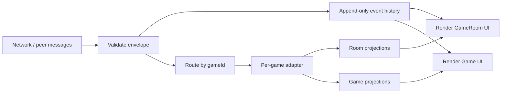

# Nhiều Game, Nhiều Loại Event — Thiết kế Kiến trúc Sự kiện

> NOTE: AI must read docs/ai/README.md before modifying this file.

Version: 2026-02-04

Changelog:

- 2026-02-01: Initial design for scaling events across many board games.
- 2026-02-01: Vietnamese rewrite for clarity (no behavior change).
- 2026-02-01: Split UI projections into 2 layers (GameRoom vs Game) and clarified TBD UI parts.
- 2026-02-03: Marked this as the planned Direction (B) for future game/event implementation; clarified current code still derives UI directly from room snapshot + presence.
- 2026-02-03: Standardized Testing section into Unit/Integration/E2E tables.
- 2026-02-04: Renamed Testing tables column to "Test Steps" and rewrote entries as ordered procedures.

## Purpose

- Định nghĩa một cách làm **có thể mở rộng** để nhận (ingest), kiểm tra (validate), lưu (store) và hiển thị (render) **rất nhiều loại event khác nhau theo từng game** cho **nhiều board game**, mà không phải nhét logic của từng game vào các UI component dùng chung.

## Goals

- Hỗ trợ số lượng **không giới hạn** event type theo từng game (vd: `chess.move`, `catan.tradeProposed`, `uno.cardPlayed`).
- Giữ UI component **ổn định** bằng cách cho UI chỉ đọc một tập nhỏ, giới hạn các dữ liệu đã “chuẩn hoá” (**normalized UI projections**).
- Lưu **đầy đủ** domain events để có thể replay/debug/audit.
- Có cơ chế fallback an toàn khi gặp event type mới/chưa hỗ trợ.
- Giữ nguyên semantics filter chat hiện có: hội thoại (conversation) vs sự kiện game (game events) vs hệ thống (system).

## Non-goals

- Không làm cơ chế “plugin loader” động hoặc chạy code từ xa.
- Không cố định nghĩa schema đầy đủ cho tất cả game ngay từ đầu.
- Không quyết định chi tiết protocol networking/host-authority ở đây (phần này nằm trong constraints/flows của dự án).

## Key Idea (Two-layer model)

## Status (Important)

- This document describes the **planned Direction (B)** for when we start implementing game domain events.
- Current Hub code does **not** yet implement the full event envelope + projection pipelines described here.
- Today, the app UI reads from room state (`RoomMetadata`, `RoomSnapshot`) plus host liveness/presence, and derives UI state locally.

1. **Domain events (theo game, rất đa dạng)**
   - Là “source of truth” cho việc trong phòng đã xảy ra cái gì.
   - Được validate bằng schema riêng của từng game.

2. **UI projections (dùng chung, ít loại và ổn định)**

    - Là dữ liệu đã “dịch” từ domain event sang thứ UI biết hiển thị.
    - Chia làm 2 tầng:
      - **GameRoom-level projections (dùng chung, ổn định):** chat, trạng thái room, highlight người chơi đến lượt, toast của room.
      - **Game-level projections (theo game):** toàn bộ hiệu ứng/animation/hiển thị đặc thù của từng game.

## Event Envelope (Transport + Persistence)

Tất cả event đi vào/đi ra đều có chung một “envelope” (phần khung) để có thể routing và validate thống nhất.

Đề xuất cấu trúc:

- `eventId`: string (UUID)
- `roomId`: string
- `gameId`: string (e.g. `chess`, `catan`)
- `eventType`: string (namespaced, ví dụ `chess.move`)
- `schemaVersion`: string (e.g. `1.0`)
- `ts`: number (unix ms)
- `actor`: `{ actorId: string, displayName?: string, role?: 'player'|'spectator'|'system' }`
- `payload`: object (tuỳ từng event)
- `meta`: `{ source: 'host'|'client'|'system', correlationId?: string }`

## Domain Event Schemas (Per game)

Mỗi game định nghĩa schema (hoặc một tập schema) cho những event mà game đó có thể phát ra.

Ví dụ:

- `chess.move` payload: `{ from: 'e2', to: 'e4', piece: 'P', promotion?: 'Q' }`
- `catan.diceRolled` payload: `{ dice: [number, number], total: number }`
- `uno.cardPlayed` payload: `{ card: 'R5'|'WILD'|..., declaredColor?: 'R'|'G'|'B'|'Y' }`

UI **không nên** phải hiểu trực tiếp các payload này.

## UI Projections (2 tầng)

UI projections được sinh ra từ domain events, nhưng tách rõ 2 tầng để tránh UI dùng chung phải hiểu logic hiển thị chi tiết của từng game.

### A) GameRoom-level projections (dùng chung)

Mục tiêu: giữ các UI phần “khung room” ổn định, dùng chung cho mọi game.

Các phần UI ngoài chat hiện **chưa có thiết kế cụ thể**, sẽ bổ sung dần. Trong tài liệu này chỉ định nghĩa **shape tối thiểu** để chuẩn bị cho việc mở rộng.

#### 1) ChatLogEntry

Dùng cho UI chat hiện tại (và các filter).

Đề xuất field:

- `id`: string
- `ts`: number
- `type`: `'user' | 'system' | 'move'`
- `tags`: `('conversation'|'gameEvent'|'system')[]`
- `text`: string (already formatted)
- `actorLabel?: string` (optional)

Quy tắc mapping:

- Tin nhắn hội thoại → `type: 'user'`, `tags: ['conversation']`
- Log từ game → `type: 'move'`, `tags: ['gameEvent']`
- Tin hệ thống → `type: 'system'`, `tags: ['system']` (luôn hiển thị)

#### 2) RoomToast

- `level`: `'info'|'success'|'warning'|'error'`
- `text`: string

#### 3) RoomTurnHighlight

- `playerId`: string
- `style`: `'pulse'|'glow'|'badge'` (tạm thời)

#### 4) RoomGameStatus

- `status`: `'playing'|'paused'`
- `reason?: string` (optional)

### B) Game-level projections (theo game)

Mục tiêu: gom toàn bộ phần **hiển thị/effect/animation** đặc thù của từng game vào một kênh riêng, để GameRoom UI không bị “phình” theo mỗi game mới.

Ví dụ dạng “projection” theo game (có thể là union type nội bộ của từng game):

#### 1) GameEffect (example)

- `kind`: string (ví dụ: `highlightMove`, `animatePiece`, `showCardFlip`)
- `target`: object (tuỳ game)
- `params`: object

Ghi chú: tài liệu này chưa chốt UI cụ thể cho các hiệu ứng/animation từng game; phần này sẽ phụ thuộc vào thiết kế UI của từng game và sẽ được bổ sung sau.

## GREM (GameRoom Event Manager) — Proposed responsibility

GREM là một **lớp mapping mỏng** (thin mapping layer), không phải game engine.

Trách nhiệm:

- Route `GameEventEnvelope` đến đúng adapter theo `gameId`.
- Validate event theo schema của game.
- Lưu raw event vào history dạng append-only.
- Phát ra (emit) các UI projections cho UI/store.
- Fallback an toàn khi event type chưa được hỗ trợ.

Không chịu trách nhiệm:

- Tính hợp lệ của nước đi (legal moves).
- Chuyển trạng thái authoritative (phải thuộc host reducer/state machine theo project constraints).

## Adapter Registry (Per game)

Mỗi game cung cấp một adapter để biến domain event thành UI projections.

Phác thảo interface:

- `adapt(event: GameEventEnvelope): { room?: { chat?: ChatLogEntry[], toasts?: RoomToast[], turnHighlight?: RoomTurnHighlight, gameStatus?: RoomGameStatus }, game?: { effects?: GameEffect[] } }`

Fallback:

- Nếu gặp event type không biết:
  - Vẫn lưu raw event.
  - Emit một `system` ChatLogEntry kiểu: `"(Unhandled event) chess.someNewThing"`.

## Data Flow



## Example (End-to-end)

Ví dụ: một domain event `chess.move` đi vào hệ thống.

### Input: GameEventEnvelope

```json
{
  "eventId": "e-001",
  "roomId": "ABCD-1234",
  "gameId": "chess",
  "eventType": "chess.move",
  "schemaVersion": "1.0",
  "ts": 1706790000000,
  "actor": { "actorId": "u-1", "displayName": "Alice", "role": "player" },
  "payload": { "from": "e2", "to": "e4", "piece": "P" },
  "meta": { "source": "host" }
}
```

### Output: Room projections (GameRoom-level)

```json
{
  "room": {
    "chat": [
      {
        "id": "e-001",
        "ts": 1706790000000,
        "type": "move",
        "tags": ["gameEvent"],
        "text": "19:40 • Alice đi P e2→e4"
      }
    ]
  }
}
```

### Output: Game projections (Game-level)

```json
{
  "game": {
    "effects": [
      {
        "kind": "highlightMove",
        "target": { "from": "e2", "to": "e4" },
        "params": { "color": "yellow" }
      }
    ]
  }
}
```

Ghi chú: ví dụ trên chỉ minh hoạ. Việc `chess.move` có tạo `RoomTurnHighlight`/`RoomGameStatus` hay không phụ thuộc state machine/flow của game và thiết kế UI tương ứng.

## Implementation Sketch (2 projection classes/pipelines)

Để tách 2 tầng projections rõ ràng khi code hoá, có thể coi đây là 2 pipeline/class khác nhau:

1) **RoomProjectionPipeline**: chỉ sinh dữ liệu cho UI khung GameRoom.

2) **GameProjectionPipeline**: chỉ sinh dữ liệu cho renderer/effects của game.

Pseudo-code (TypeScript-style):

```ts
type RoomProjections = {
  chat?: ChatLogEntry[];
  toasts?: RoomToast[];
  turnHighlight?: RoomTurnHighlight;
  gameStatus?: RoomGameStatus;
};

type GameProjections = {
  effects?: GameEffect[];
};

class RoomProjectionPipeline {
  project(event: GameEventEnvelope): RoomProjections {
    // Only room-level concerns (chat/status/turn/toast).
    // Must not depend on per-game board rendering details.
    return {};
  }
}

class GameProjectionPipeline {
  constructor(private readonly adapter: GameEventAdapter) {}
  project(event: GameEventEnvelope): GameProjections {
    // Only per-game rendering concerns (effects/animations).
    return this.adapter.adapt(event).game ?? {};
  }
}
```

## Storage Strategy

- Lưu **raw domain events** vào một log có thứ tự (append-only) theo `roomId`.
- UI projections có thể:
  - tính on-the-fly (đơn giản, an toàn), hoặc
  - cache nếu cần (tối ưu sau).

## Compatibility & Versioning

- `schemaVersion` giúp adapter hỗ trợ event cũ.
- Event mới/lạ không được làm UI crash.
- Ưu tiên thay đổi kiểu additive (thêm field), tránh breaking change.

## Testing

This document describes a planned architecture (Direction B). Tests below are **proposed** and should be implemented only when the event envelope + projection pipelines land in code.

### Unit tests

| Component | Purpose / Context | Test Steps | Expected Result |
|----------|-------------------|------------|----------------|
| Per-game adapter | Map domain event → room-level projections (chat/toast/turn/status) | Feed per-game event fixtures; assert projections emitted (Proposed; not yet implemented in repo) | Correct ChatLogEntry text + tags; correct turn/status projections |
| Projection pipelines | Keep room vs game projection separation | Build Room pipeline without game renderer; assert it only consumes room snapshot + presence (Proposed; not yet implemented in repo) | Room pipeline stays stable across games |

### Integration tests

| Component | Purpose / Context | Test Steps | Expected Result |
|----------|-------------------|------------|----------------|
| Schema validation | Validate sample events by schemaVersion | Validate fixture set against schema; assert invalid rejected and valid accepted (Proposed; not yet implemented in repo) | Invalid events rejected; valid accepted |
| Chat filters | Conversation/gameEvent/system filters in GameRoom shell | Render mixed chat; toggle flags; assert conversation/move hidden per flags while system stays (Coverage: `app/src/components/GameRoomPage.test.tsx`) | conversation/move hidden per flags; system always visible |

### E2E tests

| Component | Purpose / Context | Test Steps | Expected Result |
|----------|-------------------|------------|----------------|
| New game onboarding | Add a new game and verify no UI regressions | E2E (Playwright) — proposed; not yet implemented in repo | Unhandled events don’t crash UI; fallback system line appears |

## AI Workflow (How AI will extend for a new game)

Khi thêm game mới, AI sẽ:

1. Định nghĩa namespace event và bộ schema tối thiểu cho game đó.
2. Viết mapping trong adapter:
   - event quan trọng → dòng `move` log dễ đọc
   - lỗi nghiêm trọng → `system` line và/hoặc toast
3. Cung cấp event mẫu (fixtures) để validate.
4. Nếu UI có thay đổi, cập nhật design docs + coverage checklist để không drift.

## Open Decisions (need your choice before implementation)

1) Registry style:

- Option A: Registry compile-time (map tĩnh `gameId -> adapter`) — đơn giản, an toàn.
- Option B: Plugin loading động — linh hoạt hơn nhưng là cơ chế mới (cần bạn duyệt rõ ràng).

1) Schema language:

- Option A: JSON Schema trong `docs/config/` + runtime validator.
- Option B: TypeScript types + Zod (hoặc tương đương) để runtime validation.

1) Projection caching:

- Option A: tính projections on-the-fly.
- Option B: cache projections trong store (tối ưu sau, opt-in).
