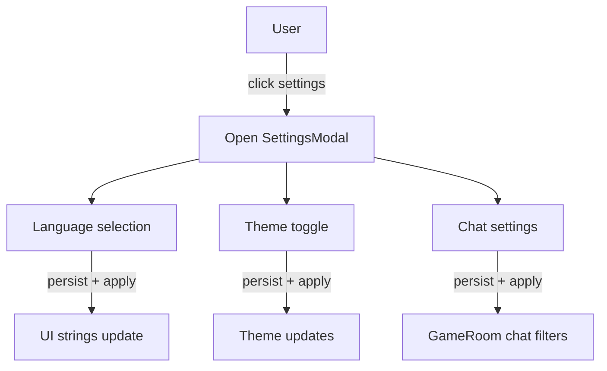

NOTE: AI must read docs/ai/README.md before modifying this file.
Version: 2026-02-04
Changelog:
- 2026-01-31: Created SettingsModal spec (Language selection dropdown, Theme toggle, Chat settings) shared by HomePage sidebar and GameRoom header.
- 2026-02-03: Standardized Testing section into Unit/Integration/E2E tables.
- 2026-02-04: Implemented SettingsModal unit tests and App entrypoint integration coverage.
- 2026-02-04: Renamed Testing tables column to "Test Steps" and rewrote entries as ordered procedures.

# SettingsModal Component Design

## Purpose
Provide a single settings surface accessible from both:
- HomePage sidebar (⚙️ Settings)
- GameRoom header (⚙️)

The modal contains 3 sections:
1) Language selection
2) Theme toggle
3) Chat settings

## User Stories
- As a user, I want to change language at any time.
- As a user, I want to switch theme (light/dark) at any time.
- As a user, I want to control what appears in the GameRoom chat stream.

## UI Components
- Modal overlay + dialog
- Section 1: **Language selection** (dropdown/select)
- Section 2: **Theme toggle** (same control semantics as current ThemeToggle doc)
- Section 3: **Chat settings**
  - Checkbox: "Hiện hội thoại trong chat" / "Show conversation in chat"
  - Checkbox: "Hiện sự kiện game trong chat" / "Show game events in chat"
- Footer: Close button

## Behaviour
- Modal opens from either entry point and closes via ✕, overlay click, or Close button.
- Language selection:
  - Same behavior as current language component: immediate UI update, persisted.
  - UI is a dropdown list (not a two-button toggle).
- Theme toggle:
  - Same behavior as current theme component: immediate UI update, persisted.
- Chat settings:
  - Persist preferences.
  - Applies to GameRoom chat rendering:
    - **Conversation** controls `Message.type === 'user'` visibility.
    - **Game events** controls `Message.type === 'move'` visibility.
    - `Message.type === 'system'` messages remain visible regardless (room-critical).

Default values:
- Show conversation: ON
- Show game events: ON

## Mermaid

## Label Localization (VN/EN)
- Settings → Cài đặt / Settings
- Language selection → Chọn ngôn ngữ / Language selection
- Vietnamese → Tiếng Việt / Vietnamese
- English → Tiếng Anh / English
- Theme → Giao diện / Theme
- Light → Sáng / Light
- Dark → Tối / Dark
- Chat settings → Cài đặt chat / Chat settings
- Show conversation in chat → Hiện hội thoại trong chat / Show conversation in chat
- Show game events in chat → Hiện sự kiện game trong chat / Show game events in chat

## Testing

### Unit tests

| Component | Purpose / Context | Test Steps | Expected Result |
|----------|-------------------|------------|----------------|
| SettingsModal | Open/close behavior | Render modal open; close via backdrop/escape/close button (as supported); assert `onClose` called (Coverage: `app/src/components/SettingsModal.test.tsx`) | Modal closes via supported paths |
| SettingsModal | Language selection persistence | Change language; assert preference stored; re-mount and assert restored (Coverage: `app/src/components/LanguageSelection.test.tsx`) | Preference stored and restored |
| SettingsModal | Theme toggle persistence | Toggle theme; assert preference stored; re-mount and assert restored (Coverage: `app/src/components/ThemeToggle.test.tsx`) | Preference stored and restored |
| SettingsModal | Chat settings toggles | Click conversation/game-events switches; assert callbacks invoked with expected values (Coverage: `app/src/components/SettingsModal.test.tsx`) | Callbacks invoked with correct values |

### Integration tests

| Component | Purpose / Context | Test Steps | Expected Result |
|----------|-------------------|------------|----------------|
| HomePage entry | Sidebar Settings opens modal | Render app on HomePage; click Settings; assert modal opens (Coverage: `app/src/App.settingsmodal.test.tsx`) | Modal opens |
| GameRoom entry | Header Settings opens modal | Render app on GameRoom; click Settings; assert modal opens (Coverage: `app/src/App.settingsmodal.test.tsx`) | Modal opens |
| Chat filtering | Chat settings affect ChatPanel rendering | Toggle chat flags; render with mixed messages; assert user/move hidden/shown while system stays (Coverage: `app/src/App.gameroom.test.tsx`) | User/move messages hide/show; system stays |

### E2E tests

| Component | Purpose / Context | Test Steps | Expected Result |
|----------|-------------------|------------|----------------|
| Shared settings | Settings persist and apply across routes | E2E (Playwright) — proposed; not yet implemented in repo | Toggle in HomePage affects GameRoom after navigation |

## DSL Configuration
- None (uses existing i18n/theme persistence mechanisms; chat settings persistence keys are implementation detail)

## Notes
- This is a shared UX surface across features; feature-level `design.md` files should link to this spec.
