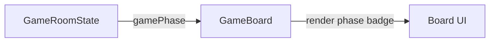

NOTE: AI must read docs/ai/README.md before modifying this file.
Version: 2026-02-04
Changelog:
- 2026-01-31: Created GameBoard component doc (placeholder rendering + phase badge).
- 2026-02-03: Standardized Testing section into Unit/Integration/E2E tables.
- 2026-02-04: Renamed Testing tables column to "Test Steps" and rewrote entries as ordered procedures.

# GameBoard Component Design

## Purpose
Render the main game board area for the current game.

## User Stories
- As a player, I want the board to be the primary focus during gameplay.
- As a spectator, I want to clearly see the current phase of the game.

## UI Components
- **Board rendering region** (game-specific UI)
- **Phase badge** (Setup / Playing / Finished)

## Current scope
- Placeholder region for game-specific rendering.
- Phase badge (Setup / Playing / Finished).
- No action bar in GameRoom (game-specific controls live inside game UI).

## Behaviour
- Game-specific UI is hosted inside the board region.
- Phase badge updates when `gamePhase` changes.

## Mermaid

## Label Localization (VN/EN)
- Setup / Setup
- Playing / Playing
- Finished / Finished

## Testing

### Unit tests

| Component | Purpose / Context | Test Steps | Expected Result |
|----------|-------------------|------------|----------------|
| GameBoard | Phase badge matches `gamePhase` | Render GameRoomPage with `phase=setup/playing/finished`; assert badge label mapping (Coverage: `app/src/components/GameRoomPage.test.tsx`) | Badge text matches (Setup/Playing/Finished) |

### Integration tests

| Component | Purpose / Context | Test Steps | Expected Result |
|----------|-------------------|------------|----------------|
| GameRoom layout | Board region remains primary and visible | Render GameRoomPage at representative breakpoints; assert board region is present and not occluded (Proposed; not yet implemented in repo) | Board occupies intended space; side sheet doesn’t cover it |

### E2E tests

| Component | Purpose / Context | Test Steps | Expected Result |
|----------|-------------------|------------|----------------|
| Board visibility | Responsive board sizing | E2E (Playwright) — proposed; not yet implemented in repo | Board visible at all breakpoints; no overflow/clipping |

## DSL Configuration
- None (board rendering is game-specific; defined per game feature)
