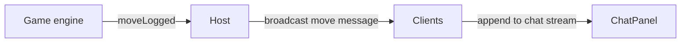

# ChatPanel Component Design

> NOTE: AI must read docs/ai/README.md before modifying this file.

<!-- markdownlint-disable MD022 MD032 MD031 MD040 MD060 -->

Version: 2026-02-04
Changelog:
- 2026-01-31: Created ChatPanel component doc; added move log message rules (plain line, no bubble).
- 2026-01-31: Added chat settings filters (show conversation, show game events).
- 2026-02-02: Clarified host-authoritative chat synchronization and message dedupe.
- 2026-02-02: Clarified unread badge placement (PC/Tablet chat tab + mobile chat button) and message-list-only scrolling.
- 2026-02-02: PC/Tablet chat sizing: full-height chat area with message list target ~70% height.
- 2026-02-02: Added Chat layout contract (anti-drift) + planned UI test coverage items.
- 2026-02-03: Standardized Testing section into Unit/Integration/E2E tables.
- 2026-02-04: Renamed Testing tables column to "Test Steps" and rewrote entries as ordered procedures.
- 2026-02-04: Implemented spectator prefix + unread badge unit coverage; implemented message-id dedupe integration coverage; added PeerJS ChatPanel E2E coverage (unread badge + reset) and linked to source.

## Purpose
- Provide an in-room chat stream for players and spectators.
- Also display **game move logs** (action history) pushed by the game engine into the same stream.

## User Stories
- As a player, I want to chat with other players during the game.
- As a spectator, I want to chat without affecting gameplay.
- As any participant, I want to see a lightweight move log (who did what when).

## UI Components
- **Header**: "Chat"
- **Scrollable message list**: mixed stream of user/system/move messages
- **Input**: text field
- **Send**: button and Enter-to-send
- **Unread badge**: shown when chat is hidden
  - PC/Tablet: badge on the **Chat tab**
  - Mobile: badge on the chat button when chat sheet is closed

## Behaviour
- Message list is append-only in chronological order.
- Messages should be consistent across peers (same ordering and content).
- User messages are rendered with sender name.
- Spectator user messages are prefixed with `[Spectator] {name}`.
- System messages are visually neutral and non-interactive.
- Move log messages are visually lightweight and non-interactive.

**Scrolling rules:**
- Message list scrolls independently (input stays visible).
- Avoid double-scroll: the side sheet container should not add another scrollbar around ChatPanel.

**PC/Tablet sizing rules:**
- On PC/Tablet, the Chat area fills the available height (below header / within side sheet).
- The message list takes the remaining available height and scrolls (it must not expand with message count).
- The input/composer stays pinned to the bottom of the chat area and uses content height.

## Layout Contract (Anti-drift)

These are **invariants** that must remain true to preserve the intended UX (no composer push-off, no message list growth).

**Side sheet Chat tab wrapper (PC/Tablet):**
- The Chat tab content wrapper must provide a **definite height** for ChatPanel.
- Required CSS characteristics:
  - `height: 100%`
  - `min-height: 0`
  - `overflow: hidden`

**ChatPanel root (PC/Tablet):**
- Must use a 2-row layout where:
  - Row 1 (message list): `minmax(0, 1fr)` and `overflow-y: auto`
  - Row 2 (composer): `auto` (content height)
- The message list must never grow the panel; it must scroll.

**Spacing contract (PC/Tablet):**
- Top padding of Chat tab, gap between message list and composer, and bottom padding of Chat tab should use a **single shared spacing token** (keeps visual rhythm consistent).

### Why this is in Markdown (not DSL)

- DSL is great for **parameter values** (tokens, thresholds, constants) that the app can read.
- This contract is primarily a **behavioral/invariant specification** (“must not create a scroll container”, “must constrain height chain”, “composer must not be pushed”) which is best expressed and reviewed as canonical design text.
- If we later want some values (like spacing token size) to be configurable, we can move **just those numbers** into a DSL file while keeping the invariants here.

**Synchronization rules:**
- The Host rebroadcasts user/system/move messages to all peers to enforce a single timeline.
- Each message must have a stable unique `id`; clients must dedupe by `id` to avoid duplicates on reconnect/resend.
- Join/leave/role-change system messages are emitted by the Host so every peer sees the same system history.

**Chat settings (from shared Settings modal):**
- **Show conversation in chat**
  - When OFF: hide `type: 'user'` messages
- **Show game events in chat**
  - When OFF: hide `type: 'move'` messages
- `type: 'system'` messages are always visible

## Message Types
### 1) User message
- Sender name shown.
- If spectator: prefix with `[Spectator] {name}`.
- Rendered as a standard chat row.

### 2) System message
- Join/leave/role change.
- Rendered as a neutral system row.

### 3) Move log message (NEW)
Game sends a message with:
- **Actor** (who)
- **Action text** (what)
- **Timestamp** (when)

**Rendering requirements:**
- Render as a **single line of text** (no chat bubble, no sender column, no message input styling).
- Format example: `{HH:mm} • {actorName} {actionText}`
  - Example: `19:42 • Alice đặt quân vào ô B3`

## Data model (design-level)
A move log can be represented as a chat message with `type: 'move'`:

```typescript
interface Message {
  id: string;
  timestamp: number;
  type: 'user' | 'system' | 'move';

  // user
  senderId?: string;
  senderName?: string;
  isSpectator?: boolean;
  text?: string;

  // move
  actorId?: string;
  actorName?: string;
  actionText?: string;
}
```

Field requirements by `Message.type`:
- `user`: requires `senderId`, `senderName`, `text` (and may set `isSpectator`)
- `system`: requires `text`
- `move`: requires `actorName`, `actionText` (and uses `timestamp` for when)

## Events
- `messageSent`: append `type: 'user'` message
- `moveLogged`: append `type: 'move'` message
- `playerJoined` / `playerLeft` / `spectatorJoined` / `spectatorLeft` / role change events: append `type: 'system'` message

## Mermaid


## Label Localization (VN/EN)
- Chat → Chat
- Placeholder: Nhập tin nhắn... / Type a message...

## Testing

### Unit tests

| Component | Purpose / Context | Test Steps | Expected Result |
|----------|-------------------|------------|----------------|
| ChatPanel | Renders user messages with sender | Render GameRoomPage with a `type:'user'` message; open Chat tab; assert message text visible (Coverage: `app/src/components/GameRoomPage.test.tsx`) | Sender name visible; text visible |
| ChatPanel | Spectator prefix | Render a spectator user message; open Chat; assert localized spectator label `[Spectator] {name}` is used (Coverage: `app/src/components/GameRoomPage.test.tsx`) | `[Spectator] {name}` prefix shown |
| ChatPanel | System messages | Render GameRoomPage with a `type:'system'` message; open Chat tab; assert system line visible (Coverage: `app/src/components/GameRoomPage.test.tsx`) | Neutral system row rendered |
| ChatPanel | Move log rendering contract | Render a `type:'move'` message; open Chat tab; assert readable single-line text appears (Coverage: `app/src/components/GameRoomPage.test.tsx`) | Single-line plain text (no bubble styling) |
| ChatPanel | Settings filters | Render with user/move/system; disable conversation+game events; assert user/move hidden while system remains (Coverage: `app/src/components/GameRoomPage.test.tsx`) | User/move messages hidden per flags; system always visible |
| ChatPanel | Unread badge (PC/Tablet + Mobile) | Render with baseline user history; while chat hidden append a new user message from someone else; assert unread badge increments on Chat tab (PC/Tablet) / chat button (Mobile); open chat; assert badge resets/hides (Coverage: `app/src/components/GameRoomPage.test.tsx`) | Badge increments only when chat hidden; opening chat clears it |

### Integration tests

| Component | Purpose / Context | Test Steps | Expected Result |
|----------|-------------------|------------|----------------|
| Host-authoritative sync | Dedupe by message id on reconnect/resend | Emit two `chat_event` payloads with the same `message.id`; assert hook only appends one message (Coverage: `app/src/hooks/useRoomContext.integration.test.ts`) | Hook state shows each message once |

### E2E tests

| Component | Purpose / Context | Test Steps | Expected Result |
|----------|-------------------|------------|----------------|
| ChatPanel | Host+peer chat sync + unread badge reset across browser/layout matrices | Run PeerJS E2E → host creates room → peer joins → both open chat exchange messages (no badge) → close chat on one side → other sends message → assert unread badge increments → open chat → badge resets (Coverage: `app/e2e/chat-panel.peerjs.spec.ts`) | Messages sync; unread badge increments only when hidden and clears when opened |
| Scroll + composer invariant | Message list scrolls; composer never pushed off-screen | E2E (Playwright) — proposed; not yet implemented in repo | Only message list scrolls; composer stays visible |
| No double scroll | Side sheet wrapper does not add a second scrollbar | E2E (Playwright) — proposed | Only message list scrolls; wrapper remains overflow-hidden |
| Spacing contract | Top/gap/bottom spacing consistent | E2E (visual regression) — proposed | Layout spacing remains stable across changes |

## Notes
- Move log messages are not interactive and are not a replacement for the normal chat input.
- Chat input remains available for user messages.

## DSL Configuration
- None (GameRoom feature-level only; no separate YAML defined for ChatPanel yet)
