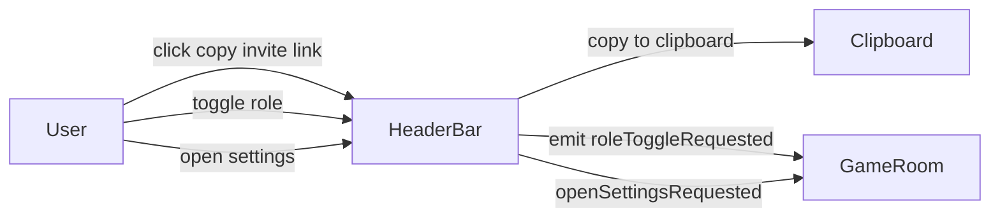

NOTE: AI must read docs/ai/README.md before modifying this file.
Version: 2026-02-04
Changelog:
- 2026-01-31: Created HeaderBar component doc.
- 2026-01-31: Wired Settings button to shared SettingsModal.
- 2026-02-02: Documented connection indicator mechanism (host-authoritative presence + instant reconnecting on connection close/error).
- 2026-02-02: Copy button now copies invite link (share URL) instead of raw room ID.
- 2026-02-02: Copy success shows a toast confirmation.
- 2026-02-03: Standardized Testing section into Unit/Integration/E2E tables.
- 2026-02-04: Renamed Testing tables column to "Test Steps" and rewrote entries as ordered procedures.

# HeaderBar Component Design

## Purpose
Provide top-level room controls and status: room identity, connectivity, role toggle, and exit.

## User Stories
- As a user, I want to quickly confirm which room/game I’m in.
- As a user, I want to copy the invite link to share.
- As a user, I want to leave the room quickly.
- As a user, I want to open Settings from the header.

## UI
- Game name + icon
- Room ID (display) + copy invite link button
- Connection status indicator (🟢 connected / 🔴 offline / 🟡 reconnecting)
- Role toggle button:
  - Player → "Làm khán giả"
  - Spectator → "Tham gia"
  - Disabled once game starts
- Leave room button
- Settings button (icon) → opens shared Settings modal

## Behaviour
- Copy button copies the invite link (share URL derived from room ID).
- After copy succeeds, show a toast confirmation.
- Role toggle is disabled once game starts.
- Connection indicator reflects current networking state.
  - Status source: host-authoritative presence updates (see `docs/features/GameRoom/design.md`).
  - Instant updates: when the underlying peer connection closes/errors, status should flip to 🟡 reconnecting immediately (no heartbeat wait).
  - Timeout-based offline: status flips to 🔴 offline only after the presence timeout window.
- Settings button opens the shared Settings modal (see `docs/components/SettingsModal.md`).

## Mermaid

## Label Localization (VN/EN)
- Làm khán giả / Become spectator
- Tham gia / Join as player
- Rời / Leave

## Testing

### Unit tests

| Component | Purpose / Context | Test Steps | Expected Result |
|----------|-------------------|------------|----------------|
| HeaderBar | Copy invite link | Render GameRoomPage; click Copy invite link; assert clipboard called and toast visible (Coverage: `app/src/components/GameRoomPage.test.tsx`) | Clipboard called with invite URL; toast shown |
| HeaderBar | Role toggle disabled once game starts | Render with `ui.canToggleRole=false` (or phase != setup); assert role toggle is disabled (Coverage: `app/src/components/GameRoomPage.test.tsx`) | Toggle disabled |
| HeaderBar | Connection indicator mapping | Render with each `ui.connectionStatus`; assert chip text/emoji maps correctly (Coverage: `app/src/components/GameRoomPage.test.tsx`) | Correct icon shown (🟢/🔴/🟡) |

### Integration tests

| Component | Purpose / Context | Test Steps | Expected Result |
|----------|-------------------|------------|----------------|
| GameRoom shell | Leave exits and cleans up room context | Click Leave; assert navigation to Home and cleanup callbacks invoked (Proposed; not yet implemented in repo) | Returns to Home; connections closed |
| SettingsModal (shared) | Header settings opens SettingsModal | Render app on GameRoom; click Settings; assert modal opens (Coverage: `app/src/App.settingsmodal.test.tsx`) | Modal opens and controls work |

### E2E tests

| Component | Purpose / Context | Test Steps | Expected Result |
|----------|-------------------|------------|----------------|
| Header actions | Copy + leave + settings in real browser | E2E (Playwright) — proposed; not yet implemented in repo | Actions behave correctly across breakpoints |

## DSL Configuration
- None (GameRoom feature-level only; no separate YAML defined for HeaderBar yet)
