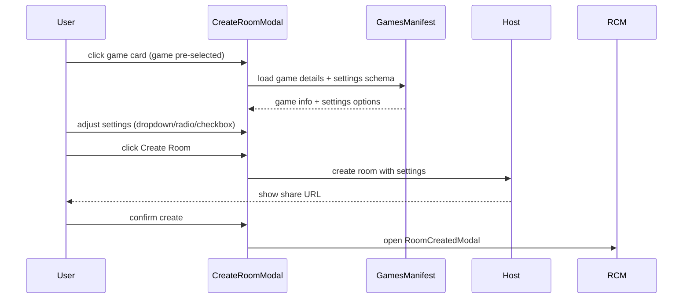

NOTE: AI must read docs/ai/README.md before modifying this file.
Version: 2026-02-04
Changelog:- 2026-02-06: Added comprehensive E2E test cases for end-to-end invite flows covering host room creation, player joining, and URL validations.- 2026-01-31: Removed obsolete "CreateRoom card/button" trigger; modal is opened via GameListGrid game card click.
- 2026-01-31: Removed extra game metadata field from CreateRoomModal.
- 2026-01-30: Added CreateRoomModal design with full game info and settings (dropdown supported).
- 2026-01-30: Added settings sections layout and dropdown list guidance.
- 2026-01-30: Added responsive layout (Option 1 wide, Option 3 narrow) and players-only metadata with essential settings always visible.
- 2026-01-30: Added VN/EN label mapping for essential metadata.
- 2026-01-30: Added RoomCreatedModal as the post-create confirmation step.
- 2026-02-03: Standardized Testing section into Unit/Integration/E2E tables.
- 2026-02-04: Renamed Testing tables column to "Test Steps" and rewrote entries as ordered procedures.

# CreateRoomModal Component Design

Purpose
- Show complete game details before room creation.
- Allow users to configure game-specific settings in a modal dialog.

User story
- As a user I select a game, review its details, adjust settings, and create a room.

Trigger mechanisms
The CreateRoomModal is opened when the user clicks any game card in GameListGrid.
- The game is pre-selected (pre-loaded) when the modal opens.

Layout overview
- Header: Game name + close button.
- Body (wide screens): **Option 1 (hybrid)** — 2 columns; media + description on the left, **essential settings** and advanced settings on the right.
- Body (narrow screens): **Option 3 (single column)** — media on top, description + essential settings below, advanced settings collapsible.
- Transition between wide ↔ narrow should be **smooth** on orientation change or window resize.
- Footer: Back (secondary) + Create Room (primary) buttons.
- **Essential settings are always visible** in both layouts (including narrow screens).
- Advanced settings panel is **hidden by default** and shown only when user clicks "Settings" button.
- Settings are grouped into sections (e.g., Basics, Advanced) for better organization.

Settings UI
- Each game can define its own settings.
- Settings list supports the following controls:
  - Toggle (on/off)
  - Radio group
  - Checkbox list
  - **Dropdown list (select) — allowed**

Settings Panel
- **Toggle Button**: "⚙️ Settings" button displayed below game description
- **Default State**: Hidden (collapsed) when modal opens
- **Expand State**: Shows Basics and Advanced sections when clicked
- **Persist State**: Remains expanded/collapsed during modal session (doesn't reset on game change)
- **Icon Indicator**: Shows ▼ when collapsed, ▲ when expanded

Essential settings (always visible)
- **Players** selector is shown as the single required **selectable** metadata control (range is game-specific).
- **Playtime** is displayed as **read-only** metadata.
- Other game-specific info (e.g., difficulty hints for co-op games) should appear in the **description text**.

Label localization (VN/EN)
- Essentials → Thiết yếu / Essentials
- Players → Số người chơi / Players
- Playtime → Thời lượng / Playtime

Settings sections (recommended)
- **Basics**: player count, time limit, difficulty.
- **Advanced**: expansion toggles, drafting mode, rules variants.

Data flow (Mermaid)

Responsive rules
- All modal sizing must use percentage-based units (%, vw, vh, clamp()) per project constraints.
- Example: modal width `min(90vw, 52rem)`; media size `clamp(10rem, 35vw, 18rem)`.

DSL config
- `create_room_modal_config.yaml` defines modal layout, sections, and default control types.

## Testing

### Unit tests

| Component | Purpose / Context | Test Steps | Expected Result |
|----------|-------------------|------------|----------------|
| CreateRoomModal | Renders selected game details | Render with selected game; assert name/media/description visible (Coverage: `app/src/components/CreateRoomModal.test.tsx`) | Name/media/description shown |
| CreateRoomModal | Essential settings always visible | Render at narrow/wide widths; assert essential controls still present (Coverage: `app/src/components/CreateRoomModal.test.tsx`) | Player selector visible in both layouts |
| CreateRoomModal | Settings panel toggles open/closed | Click settings toggle; assert advanced panel expands/collapses (Coverage: `app/src/components/CreateRoomModal.test.tsx`) | Advanced panel expands/collapses |
| CreateRoomModal | Settings controls update local state | Change dropdown/radio/checkbox; assert state updates and preview reflects selection (Coverage: `app/src/components/CreateRoomModal.test.tsx`) | State updates reflect user choices |

### Integration tests

| Component | Purpose / Context | Test Steps | Expected Result |
|----------|-------------------|------------|----------------|
| GameListGrid → CreateRoomModal | Card click pre-selects the correct game | Integration (RTL): click card then assert modal state | Modal opens with clicked game pre-selected |
| CreateRoomModal → RoomCreatedModal | Create emits room creation and opens confirmation | Integration: click Create Room with valid inputs | Host create invoked; confirmation modal opens |

### E2E tests

| Component | Purpose / Context | Test Steps | Expected Result |
|----------|-------------------|------------|----------------|
| Create room flow | Real responsive behavior and create-to-confirmation | E2E (Playwright): Open modal → select game → adjust settings → create room → assert share URL shown (Coverage: `app/e2e/homepage.spec.ts`) | Modal responsive; create results in share URL confirmation |
| End-to-end invite flow (direct URL) | Host creates room, player joins via direct invite URL | E2E (Playwright): Host creates room → copies invite URL → Player opens direct invite URL (/i/ROOMID) → joins room → assert both in same room (Coverage: `app/e2e/homepage.spec.ts`) | Host and player successfully connect via direct invite URL |
| End-to-end invite flow (redirected URL) | Host creates room, player joins via redirected invite URL | E2E (Playwright): Host creates room → copies invite URL → Player opens redirected invite URL (/?/i/ROOMID) → URL normalizes → joins room → assert both in same room (Coverage: `app/e2e/homepage.spec.ts`) | Host and player successfully connect via redirected invite URL |
