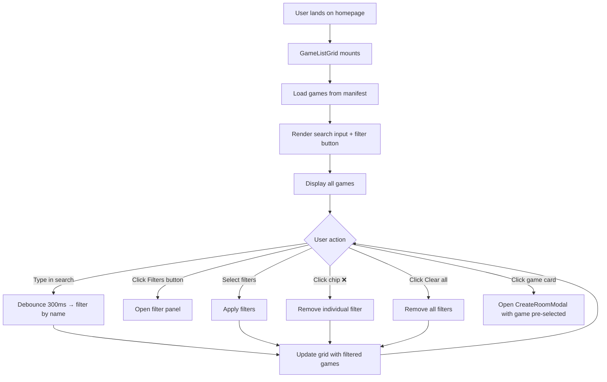
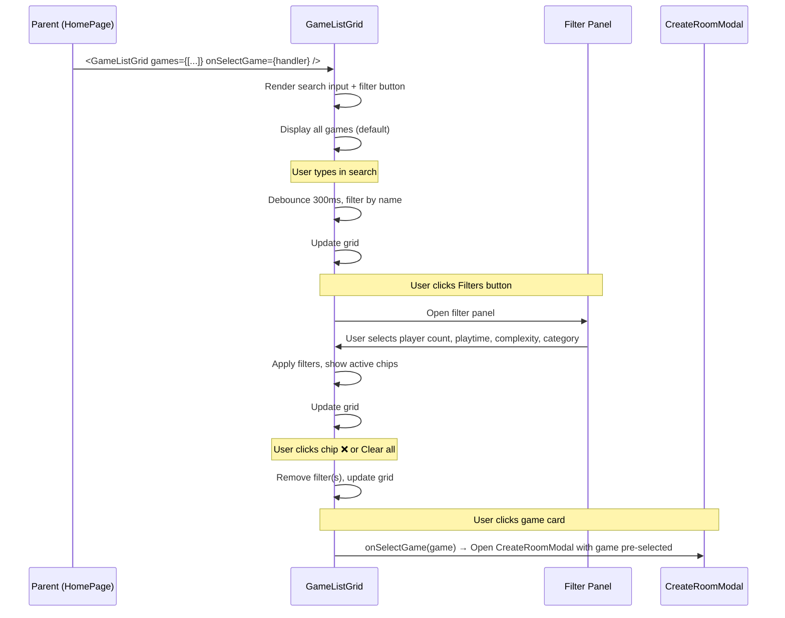

NOTE: AI must read docs/ai/README.md before modifying this file.
Version: 2026-02-04
Changelog:
- 2026-01-31: Clarified game card click behavior: clicking a game card opens CreateRoomModal with game pre-selected (this modal is opened via game card click, not via standalone "Create Room" button which was removed).
- 2026-01-31: Removed "Create Room" button, clean rewrite, checked spelling/language.
- 2026-01-31: Added search input, Tier 1+2 filter system (player count, playtime, complexity, category).
- 2026-01-30: Game card selection opens CreateRoomModal with settings.
- 2026-02-03: Standardized Testing section into Unit/Integration/E2E tables.
- 2026-02-04: Renamed Testing tables column to "Test Steps" and rewrote entries as ordered procedures.

# GameListGrid Component Design

## Purpose & User Story
- Display a browseable grid of games with search and advanced filters (Tier 1+2)
- Users can search by name, filter by player count/playtime/complexity/category
- Clicking a game card → opens CreateRoomModal with that game pre-selected
- Filter UI follows **Option B** pattern: floating filter button, collapsible panel, active filter chips

---

## Component Structure



---

## Data Flow



---

## Props & State

```typescript
interface GameInfo {
  id: string;
  name: string;
  imageUrl: string;
  minPlayers: number;
  maxPlayers: number;
  minPlaytime: number;  // minutes
  maxPlaytime: number;  // minutes
  complexity: number;   // 1-5 scale: Light (1-2), Medium (3), Heavy (4-5)
  categories: string[]; // ['Strategy', 'Cooperative', 'Party', etc.]
}

interface GameListGridProps {
  games: GameInfo[];
  onSelectGame: (game: GameInfo) => void;  // Emit when user clicks game card
}

interface GameListGridState {
  searchQuery: string;
  activeFilters: {
    playerCount: number[];       // Multi-select: [2, 3, 4]
    playtime: PlaytimeRange | null;   // Single-select: '<30' | '30-60' | '60-120' | '>120'
    complexity: ComplexityLevel | null;  // Single-select: 'light' | 'medium' | 'heavy'
    categories: string[];         // Multi-select: ['Strategy', 'Party']
  };
  filteredGames: GameInfo[];
  currentPage: number;
  pageSize: number;  // default 10 (see game_list_config.yaml)
}
```

---

## UI Layout

### Top Section (Search + Filters)

**Search Input:**
- TextField with 🔍 icon (left side)
- Clear button (❌ appears when typing)
- Placeholder: "Tìm kiếm trò chơi..." / "Search games..."
- Debounced 300ms for performance

**Filter Button:**
- Icon: 🎯 or funnel icon
- Text: "Bộ lọc" / "Filters" or "Bộ lọc (3)" / "Filters (3)" if filters active
- Click → opens filter panel (collapsible)

**Active Filter Chips (appears when filters applied):**
- Shows active filters: "2-4 players", "<30 min", "Light", "Strategy"
- Each chip has ❌ button to remove that filter
- "Clear all" button (text button) removes all filters
- Layout: Horizontal scroll on mobile, wrap on desktop

---

### Filter Panel (Option B)

**Trigger:** Click filter button  
**Desktop:** Collapsible side panel (~300px width)
**Tablet:** Slide-in side drawer (modal)
**Mobile:** Bottom sheet (slides up from bottom like Google Maps)

#### Tier 1 Filters (Essential)

1. **Player Count** — Multi-select checkboxes
   - Options: 1, 2, 3, 4, 5, 6+
   - Logic: Show game if `minPlayers <= selected <= maxPlayers`
   - Example: Select [2, 3, 4] → shows games supporting 2, 3, OR 4 players

2. **Playtime** — Single-select radio buttons
   - Options: <30 min, 30-60 min, 60-120 min, >120 min
   - Logic: Show game if playtime range overlaps selected range
   - Example: Game 45-90 min overlaps with "30-60" and "60-120"

#### Tier 2 Filters (Advanced)

3. **Complexity** — Single-select radio buttons
   - Options: Light (1-2), Medium (3), Heavy (4-5)
   - Logic: Show game if complexity falls in selected range

4. **Category/Genre** — Multi-select checkboxes
   - Options: Strategy, Party, Cooperative, Deck Building, Worker Placement, Competitive, Solo, etc.
   - Logic: Show game if ANY selected category is in `game.categories[]`

**Filter Panel Actions:**
- "Apply" button (mobile only)
- "Reset" button (clears all filters in panel)

#### Filter Logic
- **AND logic** across filter types (player count AND playtime AND complexity AND category)
- **OR logic** within multi-select filters (2 players OR 3 players)

---

### Game Grid

**Responsive columns:**
- Desktop (>1024px): 5 columns
- Tablet (768-1024px): 3 columns
- Mobile (<768px): 1-2 columns (1 on very small screens, 2 on most phones)

**Card design:**
- Elevation: 1 (default), 2 (hover)
- Corner radius: 12px
- Padding: 16px
- Image: 150×150px (aspect ratio 1:1), top of card
- Content (below image):
  - Game name: 14sp bold
  - Player count: 12sp, "2-4 người chơi" / "2-4 players"
  - Playtime: 12sp, "30-60 phút" / "30-60 min"
  - Complexity: 12sp, "Nhẹ" / "Light", "Trung bình" / "Medium", "Nặng" / "Heavy"
- Ripple effect on click
- Cursor pointer on hover

---

### Pagination

- Material-UI Pagination component (directly under search/filter row)
- Shows: "Page 1 of 10"
- Previous, page numbers, Next

---

## Responsive Design

### Desktop (>1024px)
- Search input + Filter button: Horizontal row at top
- Active filter chips below search
- Game grid: 5 columns
- Filter panel: Collapsible side panel (left or right)

### Tablet (768-1024px)
- Search input full width, Filter button below
- Active filter chips: Horizontal scroll
- Game grid: 3 columns
- Filter panel: Slide-in side drawer (modal)

### Mobile (<768px)
- Search input full width
- Filter button below search, shows active filter count
- Active filter chips: Horizontal scroll
- Game grid: 1-2 columns (adaptive), smaller cards
- Filter panel: Bottom sheet (slides up from bottom)

---

## Label Localization (VN/EN)

**Search & Filters:**
- Search placeholder: "Tìm kiếm trò chơi..." / "Search games..."
- Filters button: "Bộ lọc" / "Filters"
- Active filters count: "Bộ lọc (3)" / "Filters (3)"
- Clear all: "Xóa tất cả" / "Clear all"

**Filter Panel:**
- Player Count: "Số người chơi" / "Player Count"
- Playtime: "Thời gian chơi" / "Playtime"
- Complexity: "Độ phức tạp" / "Complexity"
- Category: "Thể loại" / "Category"
- Apply: "Áp dụng" / "Apply"
- Reset: "Đặt lại" / "Reset"

**Filter Values:**
- Complexity:
  - "Nhẹ" / "Light"
  - "Trung bình" / "Medium"
  - "Nặng" / "Heavy"
- Playtime:
  - "<30 phút" / "<30 min"
  - "30-60 phút" / "30-60 min"
  - "60-120 phút" / "60-120 min"
  - ">120 phút" / ">120 min"

**Game Card:**
- Player count: "2-4 người chơi" / "2-4 players"
- Playtime: "30-60 phút" / "30-60 min"

**Pagination:**
- Previous: "Trước" / "Prev"
- Next: "Tiếp" / "Next"
- Page indicator: "Trang X / Y" / "Page X of Y"

**Empty State:**
- No games found: "Không tìm thấy trò chơi" / "No games found"
- Clear filters link: "Xóa bộ lọc" / "Clear filters"

---

## Configuration (DSL)

See `game_list_config.yaml` for:
- Grid columns: { mobileCompact: 1, mobile: 2, tablet: 3, desktop: 5 }
- Page size: 10 (default)
- Card dimensions: image size, padding, elevation
- Material colors: primary, secondary, background
- Filter tiers: [1, 2] (enabled Tier 1+2)
- Search debounce: 300ms
- Categories: ["Strategy", "Party", "Cooperative", "Deck Building", "Worker Placement", etc.]

---

## Testing

### Unit tests

| Component | Purpose / Context | Test Steps | Expected Result |
|----------|-------------------|------------|----------------|
| GameListGrid | Search debounce (300ms) | Type into search; advance timers by 300ms; assert filter applies only after debounce (Coverage: `app/src/components/GameListGrid.test.tsx`) | Filtering only applies after 300ms |
| GameListGrid | Filter logic (AND) across tiers | Apply multiple filters; assert results are the intersection (Coverage: `app/src/components/GameListGrid.test.tsx`) | Result set matches intersection |
| GameListGrid | Chips reflect active filters | Apply/remove filters; assert chips and count badge update (Coverage: `app/src/components/GameListGrid.test.tsx`) | Chips appear/remove; count badge updates |
| GameListGrid | Clear all resets state | Click clear all; assert filters cleared and full list returns (Coverage: `app/src/components/GameListGrid.test.tsx`) | All filters cleared; grid shows full list |
| GameListGrid | Pagination boundaries | Navigate pages; assert next/prev disable at edges (Coverage: `app/src/components/GameListGrid.test.tsx`) | Next disabled at last page; prev disabled at first |
| GameCard click | Opens CreateRoomModal with pre-selected game | Click a card; assert selection callback is invoked with clicked game (Coverage: `app/src/components/GameListGrid.test.tsx`) | `onSelectGame(game)` called with clicked game |

### Integration tests

| Component | Purpose / Context | Test Steps | Expected Result |
|----------|-------------------|------------|----------------|
| HomePage + GameListGrid + CreateRoomModal | Card click opens modal and preserves selection | Integration (RTL): click card, assert modal open and selected game id | Modal shows correct game; essential settings visible |
| Responsive layout | Columns and filter UI change by breakpoint | Integration (viewport-driven test): render at desktop/tablet/mobile widths | Correct grid columns and filter surface behavior |

### E2E tests

| Component | Purpose / Context | Test Steps | Expected Result |
|----------|-------------------|------------|----------------|
| Browse + create | Search/filter/paginate + create room on real browser | E2E (Playwright) — proposed; not yet implemented in repo | Flow works across breakpoints; no layout regressions |

---

## Open Questions / Future Work
- Game-specific features/actions (designed per-game separately)
- Advanced sorting (e.g., release date)

