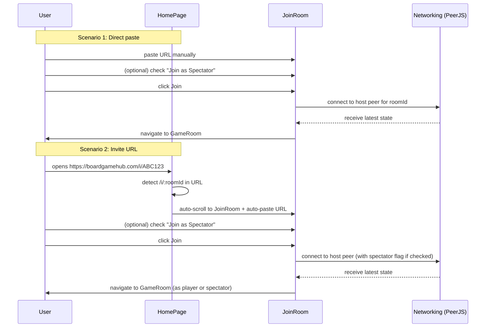

NOTE: AI must read docs/ai/README.md before modifying this file.
Version: 2026-02-06
Changelog:
- 2026-02-06: Added E2E test case for GitHub Pages SPA redirect link handling in JoinRoom component.
- 2026-01-31: Added spectator mode checkbox, invite URL auto-paste behavior.
- 2026-02-02: Joining requires a valid saved display name (no empty / no quotes-only like "\"\"").
- 2026-02-02: Clarified invite URL behavior is prefill + scroll (no auto-join).
- 2026-02-02: Split invite URL (/i/:roomId) from GameRoom URL (/room/:roomId).
- 2026-02-03: Standardized Testing section into Unit/Integration/E2E tables.
- 2026-02-04: Renamed Testing tables column to "Test Steps" and rewrote entries as ordered procedures.

# JoinRoom Component Design

## Purpose
- Let user paste a share URL and join the corresponding room as **player** or **spectator**.
- Support invite URL auto-scroll and auto-paste when opened from external link.
- Require a valid saved display name before joining.

## User Stories
- As a user, I want to paste a room URL and join as a player (default).
- As a user, I want to check "Join as Spectator" to observe the game without playing.
- When I open an invite URL in browser, the page scrolls to JoinRoom and auto-pastes the URL.
- As a user, I must enter and save my name before I can join a room.

## UI Components
- **Title**: "Tham gia phòng" / "Join Room"
- **TextField**: Paste room URL (readonly if auto-filled from invite link)
  - Placeholder: "Dán liên kết phòng" / "Paste room URL"
  - Validation: Real-time check for valid room URL format
- **Checkbox**: "Tham gia với tư cách khán giả" / "Join as Spectator"
  - **Default:** Unchecked (user joins as player)
  - **Label position:** Below URL field, left-aligned
- **Join Button**: "Tham gia" / "Join"
  - Disabled if URL is invalid or empty
- **Name gate** (cross-section behavior):
  - If user attempts to join without a valid saved name, join is blocked.
  - UI scrolls to WelcomeSection and shows an inline validation message.
- **Error message** (if URL invalid): "Liên kết phòng không hợp lệ" / "Invalid room URL"

## Invite URL Behavior
When user opens invite URL (e.g., `https://boardgamehub.com/i/ABC123`):
1. **Page loads** → HomePage rendered
2. **Auto-scroll** → Smooth scroll to JoinRoom section (using `scrollIntoView`)
3. **Auto-paste** → Extract `roomId` from URL → auto-fill TextField with full share URL
4. **Focus** → TextField gets focus (user can see URL is ready)
5. **User action** → User can check spectator checkbox if desired → Click Join

This flow does **not** auto-join on page load; it only pre-fills and scrolls the JoinRoom UI.

GameRoom URL (e.g., `/room/:roomId`) is **not** an invite link.

**Implementation note:** 
- Check `window.location.pathname` on HomePage mount
- If matches `/i/:roomId`, trigger scroll + paste
- Parse `roomId` from `window.location.pathname` (invite is a path param, not a query param)

## Flow Diagram

## Label Localization (VN/EN)
- **Title**: Tham gia phòng / Join room
- **Placeholder**: Dán liên kết phòng / Paste room URL
- **Checkbox label**: Tham gia với tư cách khán giả / Join as Spectator
- **Button**: Tham gia / Join
- **Error (invalid URL)**: Liên kết phòng không hợp lệ / Invalid room URL

## DSL Configuration
- `hub_config.yaml`: 
  - `roomUrlPattern`: Regex or template for valid room URLs
  - `inviteUrlPrefix`: `/i/` (for routing)

## Testing

### Unit tests

| Component | Purpose / Context | Test Steps | Expected Result |
|----------|-------------------|------------|----------------|
| JoinRoom | URL validation + error messaging | Type invalid URL; assert i18n error; type valid URL; assert error cleared (Coverage: `app/src/components/JoinRoom.test.tsx`) | Invalid shows i18n error; valid clears error |
| JoinRoom | Join disabled for invalid/empty URL | Assert Join disabled initially; type invalid; still disabled; type valid; enabled (Coverage: `app/src/components/JoinRoom.test.tsx`) | Disabled when empty/invalid; enabled when valid |
| JoinRoom | Spectator default unchecked | Render and assert spectator checkbox unchecked (Coverage: `app/src/components/JoinRoom.test.tsx`) | Checkbox is unchecked |

### Integration tests

| Component | Purpose / Context | Test Steps | Expected Result |
|----------|-------------------|------------|----------------|
| HomePage name gate + JoinRoom | Join blocked when displayName is not valid/saved | Integration (RTL): attempt Join with no saved name | Join prevented; page scrolls to WelcomeSection; inline error visible |
| Invite URL routing | `/i/:roomId` prefill + scroll + focus (no auto-join) | Integration (RTL + jsdom): mount HomePage with invite pathname | JoinRoom is focused; URL prefilled; join not triggered |

### E2E tests

| Component | Purpose / Context | Test Steps | Expected Result |
|----------|-------------------|------------|----------------|
| Join from invite | Real browser scroll + focus behavior | E2E (Playwright): goto /i/ROOMID → assert scroll to JoinRoom → assert URL prefilled + focused (Coverage: `app/e2e/homepage.spec.ts`) | Invite link opens, scrolls to JoinRoom, pre-fills URL, focuses input |
| Join from redirected invite | GitHub Pages SPA redirect handling | E2E (Playwright): goto / ? /i/ROOMID → assert URL normalizes to /i/ROOMID → assert JoinRoom prefill + focus → click Join → assert room joined (Coverage: `app/e2e/homepage.spec.ts`) | Redirected invite URLs work end-to-end, joining room successfully |

Notes
- Use MUI `TextField` and `Button`.
- Validate URL format client-side before connecting.
