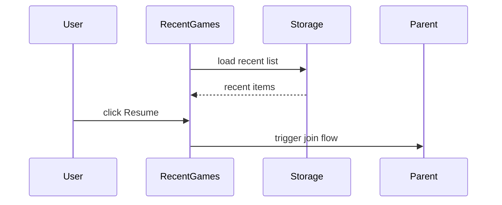

NOTE: AI must read docs/ai/README.md before modifying this file.
Version: 2026-02-04
Changelog:
- 2026-01-30: Added note that newly created rooms are saved and shown in RecentGames.
- 2026-02-03: Standardized Testing section into Unit/Integration/E2E tables.
- 2026-02-04: Renamed Testing tables column to "Test Steps" and rewrote entries as ordered procedures.

# RecentGames Component Design

Purpose
- Show user's recent rooms/games from local persistence for quick resume.

Behaviour
- Read recent entries from IndexedDB (primary source of truth).
- Cross-tab freshness: listen via `BroadcastChannel` and reload from IndexedDB when a "recent games" update is broadcast.
- Show timestamp, players, and resume button
- Include rooms created in the current session (from RoomCreatedModal persistence)

Mermaid

DSL
- `recent_games_config.yaml` contains max entries, display format

Label localization (VN/EN)
- Recent rooms (title) → Phòng gần đây / Recent rooms
- Resume (button) → Tiếp tục / Resume
- Clear all → Xóa tất cả / Clear all
- No recent rooms → Chưa có phòng nào / No recent rooms
- {time} ago → {time} trước / {time} ago
- {N} players → {N} người chơi / {N} players

## Testing

### Unit tests

| Component | Purpose / Context | Test Steps | Expected Result |
|----------|-------------------|------------|----------------|
| RecentGames | Empty state rendering | Render with empty list; assert empty-state copy and no rows (Coverage: `app/src/components/RecentGames.test.tsx`) | Empty message shown; no list rows |
| RecentGames | Renders items with timestamps and buttons | Render with sample items; assert time + player count + Resume present (Coverage: `app/src/components/RecentGames.test.tsx`) | Rows show name/time/player count; Resume visible |
| RecentGames | Clear all removes items | Click Clear all; assert persistence cleared and UI shows empty state (Coverage: `app/src/components/RecentGames.test.tsx`) | Persistence clear invoked; UI updates to empty state |

### Integration tests

| Component | Purpose / Context | Test Steps | Expected Result |
|----------|-------------------|------------|----------------|
| Create flow → RecentGames | RoomCreatedModal persistence appears in RecentGames | Integration (RTL): simulate create flow and then render RecentGames | Newly created room appears in list |
| Cross-tab freshness | BroadcastChannel triggers reload | Integration (mock channel): emit update event | Component reloads from IndexedDB and updates UI |

### E2E tests

| Component | Purpose / Context | Test Steps | Expected Result |
|----------|-------------------|------------|----------------|
| Recent rooms persistence | Real IndexedDB persistence and clear | E2E (Playwright) — proposed; not yet implemented in repo | Rooms persist across reload; clear removes them |

Notes
- Use MUI `List` and `ListItem` with avatars for thumbnails
