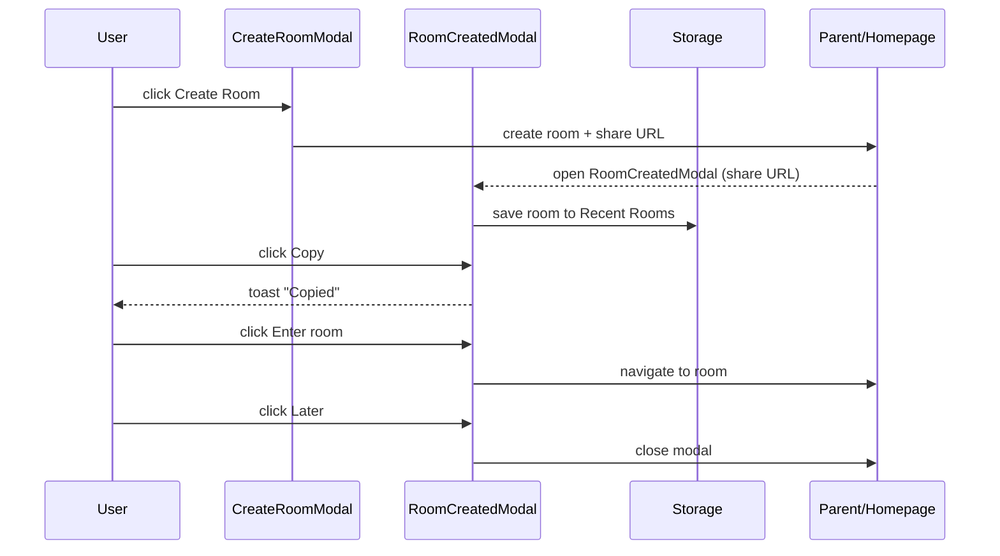

# RoomCreated Modal (Design)

> NOTE: AI must read docs/ai/README.md before modifying this file.

Version: 2026-02-04

Changelog:

- 2026-01-30: Added RoomCreated modal design for share URL, enter room, and later actions.
- 2026-02-02: Clarified that Later closes modal and leaves the room (returns to HomePage).
- 2026-02-02: Updated Later behavior: close modal and return to HomePage while keeping the hosted room running in background.
- 2026-02-03: Standardized Testing section into Unit/Integration/E2E tables.
- 2026-02-04: Renamed Testing tables column to "Test Steps" and rewrote entries as ordered procedures.

Purpose

- Confirm room creation and provide a share URL for inviting friends.
- Offer clear next steps: enter the room now or do it later.

User story

- As a user, after creating a room I want to copy the invite link and choose to enter now or later.

Trigger

- Opens immediately after user clicks **Create Room** in CreateRoomModal.

Layout overview

- Header: "Phòng đã được tạo 🎉" (VI) / "Room created 🎉" (EN) + close button.
- Body:
  - Share URL (read-only field)
  - Primary copy button ("Sao chép" / "Copy")
  - Helper text: "Gửi link này để mời bạn bè" (VI) / "Share this link to invite friends" (EN)
- Footer actions:
  - Primary: "Vào phòng" / "Enter room"
  - Secondary: "Để sau" / "Later"

Behavior

- Copy button copies share URL to clipboard and shows a toast/inline confirmation.
- "Vào phòng" navigates into the room (host view).
- "Để sau" closes the modal and returns to HomePage while keeping the hosted room running in background (host stays online).
  - HomePage shows a small banner indicating the room is running with actions: **Open room** (enter room UI) and **End room** (destroy room).
- Closing the modal does NOT delete the room.

Persistence

- Newly created rooms are stored in browser persistence (IndexedDB/LocalStorage) and appear in **Recent Rooms**.

Data flow (Mermaid)

Label localization (VN/EN)

- Room created → Phòng đã được tạo
- Share URL → Link mời
- Copy → Sao chép
- Enter room → Vào phòng
- Later → Để sau

DSL config

- `room_created_modal_config.yaml` defines layout, text labels, and buttons.

## Testing

### Unit tests

| Component | Purpose / Context | Test Steps | Expected Result |
|----------|-------------------|------------|----------------|
| RoomCreatedModal | Copy copies invite URL and shows confirmation | Click Copy; assert clipboard called; assert confirmation feedback visible (Coverage: `app/src/components/RoomCreatedModal.test.tsx`) | Clipboard called; toast/inline success shown |
| RoomCreatedModal | Enter room action | Click Enter room; assert navigate callback called with room route (Coverage: `app/src/components/RoomCreatedModal.test.tsx`) | Navigate callback called with room route |
| RoomCreatedModal | Later closes modal but keeps room running | Click Later; assert modal closes and host session not destroyed (Coverage: `app/src/components/RoomCreatedModal.test.tsx`) | Modal closes; host session remains active (no destroy called) |

### Integration tests

| Component | Purpose / Context | Test Steps | Expected Result |
|----------|-------------------|------------|----------------|
| CreateRoomModal → RoomCreatedModal | Confirmation opens immediately after create | Integration (RTL): create room and assert modal content | Share URL displayed; buttons wired |
| Later → HomePage banner | Later returns to HomePage with room-running banner | Integration: click Later and assert banner exists | Banner shows Open room / End room actions |

### E2E tests

| Component | Purpose / Context | Test Steps | Expected Result |
|----------|-------------------|------------|----------------|
| Copy + navigation | Real clipboard and route transitions | E2E (Playwright) — proposed; not yet implemented in repo | Copy works; Enter navigates; Later returns to HomePage |
