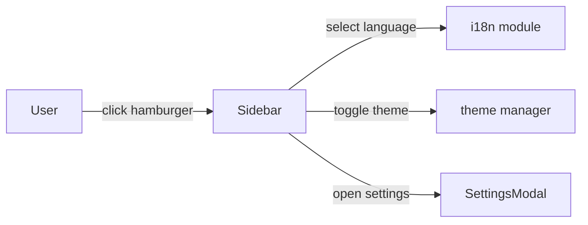

NOTE: AI must read docs/ai/README.md before modifying this file.
Version: 2026-02-04
Changelog:
- 2026-01-31: Added Settings button back into sidebar; Settings opens SettingsModal (language selection, theme toggle, chat settings).
- 2026-01-31: Fixed Mermaid diagram syntax to render reliably in Markdown preview.
- 2026-01-30: Documented full-height sidebar requirement.
- 2026-02-02: Clarified hamburger toggle positioning pinned to the drawer right edge and synced with the drawer transition.
- 2026-02-02: Sidebar defaults to closed on refresh/first load.
- 2026-02-03: Standardized Testing section into Unit/Integration/E2E tables.
- 2026-02-04: Renamed Testing tables column to "Test Steps" and rewrote entries as ordered procedures.

# Sidebar Component Design

## Purpose
- Left-side navigation drawer (overlay on mobile, persistent on desktop).
- Contains essentials: logo/title, language selection (EN/VI), theme toggle, settings.

## User Stories
- As a user I can open the nav, change language, and toggle theme quickly.
- As a user I can open Settings modal from the sidebar.

## UI Components
- Logo/title
- Language selection (dropdown)
- Theme toggle
- Settings button (opens SettingsModal)

## Behaviour
- Sidebar is a drawer: overlay on mobile, persistent on desktop.
- Default state on refresh/first load: **closed**.
- Hamburger (nav toggle) button is pinned to the **right edge of the sidebar** and shifts horizontally when the sidebar opens/closes.
  - The button must remain reachable in both states.
  - The button must move **in sync** with the drawer open/close animation (no lagging “catch up”).
  - Implementation guidance (for non-static layouts): compute the drawer’s current right edge (e.g., via `getBoundingClientRect()` on the drawer surface / paper) and position the button relative to that edge.
- Settings button opens shared SettingsModal.

## Mermaid

## DSL
- See `sidebar_config.yaml` for width, overlay behaviour, and items order.

## Label Localization (VN/EN)
- BoardGame Hub (logo/title) → BoardGame Hub / BoardGame Hub

## Testing

### Unit tests

| Component | Purpose / Context | Test Steps | Expected Result |
|----------|-------------------|------------|----------------|
| Sidebar | Default closed on first load/refresh | Render sidebar initial state; assert drawer is closed and hamburger is visible (Coverage: `app/src/components/Sidebar.test.tsx`) | Drawer starts closed |
| Sidebar toggle button | Toggle pinned to sidebar right edge and moves in sync | Toggle open/close; assert hamburger x-position tracks drawer right edge (Coverage: `app/src/components/Sidebar.test.tsx`) | Toggle remains reachable; position updates without lag |
| Sidebar actions | Language/theme changes propagate | Change language selection; toggle theme; assert callbacks + persistence called (Coverage: `app/src/components/Sidebar.test.tsx`) | UI update callbacks invoked; preferences persisted |
| Settings button | Open SettingsModal | Click Settings; assert modal open state (Coverage: `app/src/App.settingsmodal.test.tsx`) | `openSettingsRequested` fired; modal opens |

### Integration tests

| Component | Purpose / Context | Test Steps | Expected Result |
|----------|-------------------|------------|----------------|
| HomePage + Sidebar | Overlay vs persistent behavior by breakpoint | Integration (viewport-driven test): render at mobile vs desktop widths | Mobile uses overlay; desktop uses persistent drawer |

### E2E tests

| Component | Purpose / Context | Test Steps | Expected Result |
|----------|-------------------|------------|----------------|
| Sidebar (responsive) | Toggle accessibility and persistence across reload | E2E (Playwright) — proposed; not yet implemented in repo | Toggle works on all breakpoints; language/theme persist after reload |

## Notes
- Implement using Material UI `Drawer` and `List` components.
- Ensure accessible focus trapping when open.
- Sidebar should use full viewport height (100vh).

## DSL Configuration
- None (sidebar layout DSL lives in `sidebar_config.yaml`)
