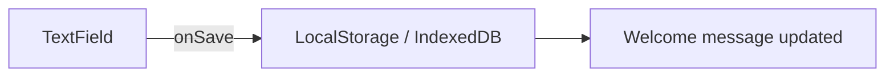

NOTE: AI must read docs/ai/README.md before modifying this file.

Version: 2026-02-04
Changelog:
- 2026-02-03: Standardized document structure and added Unit/Integration/E2E testing tables.
- 2026-02-04: Renamed Testing tables column to "Test Steps" and rewrote entries as ordered procedures.

# DisplayNameInput Component Design

## Purpose
- Single input field to capture player's displayName.
- Located immediately below greeting in WelcomeSection.

## Props & Behaviour
- `value` (string), `onChange`, `onSave` handlers
- Local validation: non-empty, max length (configurable)
- Persists to IndexedDB (primary) on save; LocalStorage is optional fallback

## Mermaid

## Cross-tab freshness
- When saved, broadcast an update event (via `BroadcastChannel`) so other tabs can re-read the latest value from IndexedDB.

## DSL
- `displayname_config.yaml` defines `storageKey`, `maxLength`, UI placeholder.

## Testing

### Unit tests

| Component | Purpose / Context | Test Steps | Expected Result |
|----------|-------------------|------------|----------------|
| DisplayNameInput | Validation rejects empty/whitespace | Render via WelcomeSection; click Save with empty value; assert localized error and `onSaveName` not called (Coverage: `app/src/components/WelcomeSection.test.tsx`) | Localized error shown; `onSave` not called |
| DisplayNameInput | Respects max length | Type beyond max length; assert input clamps or shows overflow feedback (Proposed; not yet implemented in repo) | Input prevents/flags overflow per config |
| DisplayNameInput | Save calls persistence handlers | Type valid name; click Save; assert `onSaveName` called with trimmed name (Coverage: `app/src/components/WelcomeSection.test.tsx`) | `onSave` called with trimmed name |

### Integration tests

| Component | Purpose / Context | Test Steps | Expected Result |
|----------|-------------------|------------|----------------|
| WelcomeSection composition | Saving updates greeting state | Render WelcomeSection; save a valid name; assert greeting updates to "Welcome back, {name}" (Coverage: `app/src/components/WelcomeSection.test.tsx`) | Greeting updates to "Welcome back, {name}" |

### E2E tests

| Component | Purpose / Context | Test Steps | Expected Result |
|----------|-------------------|------------|----------------|
| Display name persistence | Real browser persistence across reload | E2E (Playwright) — proposed; not yet implemented in repo | Name is prefilled after reload/new tab |

## Implementation notes
- Use MUI `TextField` and `IconButton` for save/edit
- Respect i18n keys for placeholders and errors
