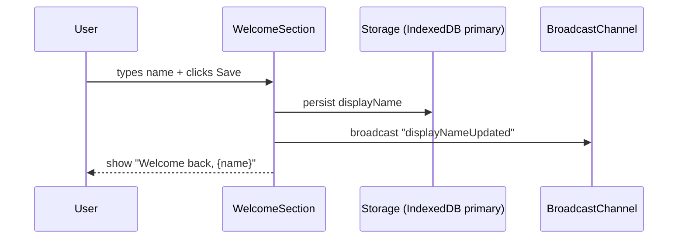

NOTE: AI must read docs/ai/README.md before modifying this file.

Version: 2026-02-04
Changelog:
- 2026-02-03: Standardized document structure and added Unit/Integration/E2E testing tables.
- 2026-02-04: Renamed Testing tables column to "Test Steps" and rewrote entries as ordered procedures.

# WelcomeSection Component Design

## Purpose
- Show greeting and `DisplayNameInput` (name input below greeting).
- Show localized welcome message (uses `docs/config/i18n.yaml`).

## User Stories
- As a user I see a greeting and can enter my display name which is saved in browser.

## Data Flow (Mermaid)

## DSL Config
- `displayname_config.yaml` contains default placeholder, persistence key, and validation rules.

## Label Localization (VN/EN)
- Welcome → Chào mừng đến với BoardGame Hub / Welcome to BoardGame Hub
- Welcome back → Chào mừng quay lại, {name} / Welcome back, {name}
- Enter name → Nhập tên của bạn / Enter your name
- Player name (placeholder) → Tên người chơi / Player name
- Save → Lưu / Save
- Edit → Sửa / Edit

## Testing

### Unit tests

| Component | Purpose / Context | Test Steps | Expected Result |
|----------|-------------------|------------|----------------|
| WelcomeSection | Renders greeting and name input | Render with `displayName=""`; assert welcome copy + labeled input; render with saved name; assert "Welcome back" copy (Coverage: `app/src/components/WelcomeSection.test.tsx`) | Correct localized greeting shown; input present when needed |
| WelcomeSection | Save triggers persistence + broadcast | Type valid name; click Save; assert `onSaveName` called with trimmed value (Coverage: `app/src/components/WelcomeSection.test.tsx`) | displayName persisted; broadcast sent |

### Integration tests

| Component | Purpose / Context | Test Steps | Expected Result |
|----------|-------------------|------------|----------------|
| Cross-tab freshness | Other tabs reload displayName after broadcast | Save name; emit broadcast event; re-read from persistence and re-render greeting (Proposed; not yet implemented in repo) | UI updates to latest saved name |

### E2E tests

| Component | Purpose / Context | Test Steps | Expected Result |
|----------|-------------------|------------|----------------|
| Name persistence | Real IndexedDB persistence across reload/new tab | E2E (Playwright) — proposed; not yet implemented in repo | Name persists across reloads and across tabs |

## Notes
- Canonical persistence is IndexedDB. Other tabs should listen on `BroadcastChannel` and re-read from IndexedDB to get the latest value.
- Use Material UI `TextField` and `Button`.
- Save preference for language alongside name if user sets it.
