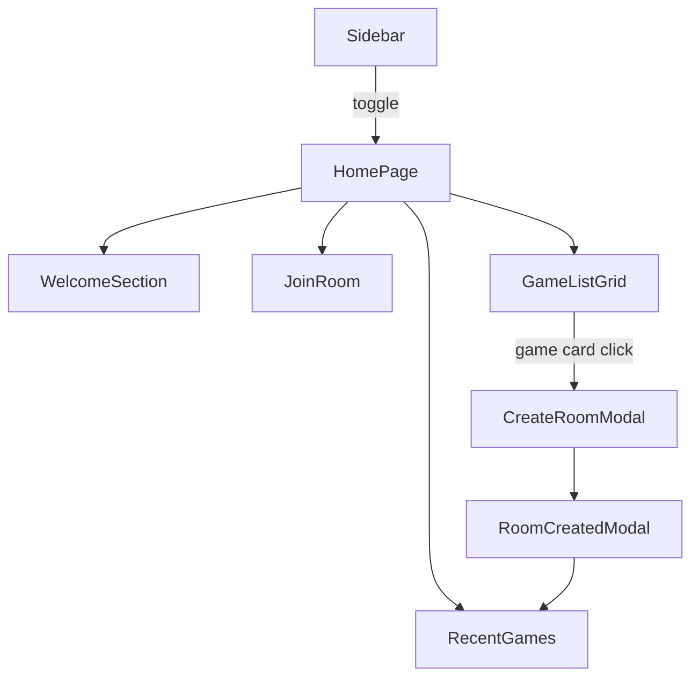

NOTE: AI must read docs/ai/README.md before modifying this file.
Version: 2026-02-04
Changelog:
- 2026-01-31: Added RecentGames section to homepage (displayed inline, not in sidebar).
- 2026-01-31: Removed standalone "Tạo phòng mới" action card (game cards trigger CreateRoomModal on click); simplified sidebar to essentials (logo, language, theme); removed RecentGames from sidebar.
- 2026-01-31: Consolidated HomePage feature docs: merged Homepage.md into this design.md and made this file the canonical source for the feature.
- 2026-01-31: Added Coverage checklist section (spec ↔ mockup traceability) to prevent drift.
- 2026-01-30: Documented full-width main content and full-height navigation bar.
- 2026-01-31: Renamed Language toggle to Language selection (dropdown) and added Settings button opening SettingsModal.
- 2026-02-02: Clarified Sidebar hamburger toggle positioning: pinned to the sidebar right edge and moves in sync with sidebar open/close.
- 2026-02-02: Clarified display name rules: joining/creating requires a valid saved name (reject quotes-only like "\"\"").
- 2026-02-02: Split invite URL (/i/:roomId) from GameRoom URL (/room/:roomId).
- 2026-02-03: Standardized Testing section into Unit/Integration/E2E tables.
- 2026-02-03: Recorded current Playwright E2E coverage (core flows) and kept breakpoint coverage explicitly proposed.
- 2026-02-04: Implemented Playwright breakpoint E2E coverage (desktop/tablet/mobile).
- 2026-02-04: Renamed Testing tables column to "Test Steps" and rewrote entries as ordered procedures.

# Homepage Design

## Purpose
Landing page where users can discover games, join existing rooms, or create new rooms by clicking game cards.

## Feature Canonical Source
This file (`design.md`) is the canonical design source for the **HomePage** feature. Any other HomePage docs (component specs, DSL/YAML, and HTML mockups) must align with this.

## Coverage Checklist (Required)
This checklist is the anti-drift gate for the HomePage feature. Every behavioral item below must be:
1) specified in component docs, and
2) implemented in the feature mockup, OR explicitly marked as not covered (with a link to where it is covered).

Legend: ✅ implemented in HomePage mockup, ↗ covered elsewhere, ❌ missing

| Area | Behavior | Spec | Mockup | Status |
|------|----------|------|--------|--------|
| Welcome | Display name must be entered and saved before Join/Create; attempts without name scroll to Welcome + show inline error | [design.md](design.md) | [HOMEPAGE_MOCKUP.html](HOMEPAGE_MOCKUP.html) | ✅ |
| Welcome | Display name validation rejects quotes-only names (e.g. "\"\"") | [design.md](design.md) | [HOMEPAGE_MOCKUP.html](HOMEPAGE_MOCKUP.html) | ✅ |
| Sidebar | Hamburger toggle is pinned to the **right edge** of the sidebar and remains reachable in both states (open/closed) | [Sidebar.md](Sidebar/Sidebar.md) | [HOMEPAGE_MOCKUP.html](HOMEPAGE_MOCKUP.html) | ✅ |
| Sidebar | Hamburger toggle moves **in sync** with the sidebar open/close animation (no lag / no separate easing delay) | [Sidebar.md](Sidebar/Sidebar.md) | [HOMEPAGE_MOCKUP.html](HOMEPAGE_MOCKUP.html) | ✅ |
| Sidebar | Language selection (dropdown) changes UI strings immediately and persists | [Sidebar.md](Sidebar/Sidebar.md), [LanguageSelection.md](LanguageSelection/LanguageSelection.md) | [HOMEPAGE_MOCKUP.html](HOMEPAGE_MOCKUP.html) | ✅ |
| Sidebar | Theme toggle (light/dark) applies theme immediately and persists | [Sidebar.md](Sidebar/Sidebar.md), [ThemeToggle.md](ThemeToggle/ThemeToggle.md) | [HOMEPAGE_MOCKUP.html](HOMEPAGE_MOCKUP.html) | ✅ |
| Sidebar | Settings button opens SettingsModal (language, theme, chat settings) | [Sidebar.md](Sidebar/Sidebar.md), [SettingsModal.md](../../components/SettingsModal.md) | [HOMEPAGE_MOCKUP.html](HOMEPAGE_MOCKUP.html) | ✅ |
| JoinRoom | URL validation + error message; Join disabled when invalid/empty | [JoinRoom.md](JoinRoom/JoinRoom.md) | [HOMEPAGE_MOCKUP.html](HOMEPAGE_MOCKUP.html), [JOINROOM_MOCKUP.html](JoinRoom/JOINROOM_MOCKUP.html) | ✅ |
| JoinRoom | Spectator checkbox default unchecked; join uses player/spectator mode | [JoinRoom.md](JoinRoom/JoinRoom.md) | [HOMEPAGE_MOCKUP.html](HOMEPAGE_MOCKUP.html), [JOINROOM_MOCKUP.html](JoinRoom/JOINROOM_MOCKUP.html) | ✅ |
| JoinRoom | Invite URL `/i/:roomId` → `scrollIntoView` JoinRoom + auto-fill + focus | [JoinRoom.md](JoinRoom/JoinRoom.md) | [HOMEPAGE_MOCKUP.html](HOMEPAGE_MOCKUP.html), [JOINROOM_MOCKUP.html](JoinRoom/JOINROOM_MOCKUP.html) | ✅ |
| GameListGrid | Responsive columns: desktop 5, tablet 3, mobile 1–2 (1 only when <=360px) | [GameListGrid.md](GameList/GameListGrid.md) | [HOMEPAGE_MOCKUP.html](HOMEPAGE_MOCKUP.html), [GAMELIST_MOCKUP.html](GameList/GAMELIST_MOCKUP.html) | ✅ |
| GameListGrid | Search by name with debounce 300ms | [GameListGrid.md](GameList/GameListGrid.md) | [HOMEPAGE_MOCKUP.html](HOMEPAGE_MOCKUP.html), [GAMELIST_MOCKUP.html](GameList/GAMELIST_MOCKUP.html) | ✅ |
| GameListGrid | Filter panel Option B (desktop side panel, tablet drawer, mobile bottom sheet) | [GameListGrid.md](GameList/GameListGrid.md) | [HOMEPAGE_MOCKUP.html](HOMEPAGE_MOCKUP.html), [GAMELIST_MOCKUP.html](GameList/GAMELIST_MOCKUP.html) | ✅ |
| GameListGrid | Mobile Apply (Apply button only on mobile; desktop/tablet apply immediately) | [GameListGrid.md](GameList/GameListGrid.md) | [HOMEPAGE_MOCKUP.html](HOMEPAGE_MOCKUP.html), [GAMELIST_MOCKUP.html](GameList/GAMELIST_MOCKUP.html) | ✅ |
| GameListGrid | Active filter chips + count badge + clear all | [GameListGrid.md](GameList/GameListGrid.md) | [HOMEPAGE_MOCKUP.html](HOMEPAGE_MOCKUP.html), [GAMELIST_MOCKUP.html](GameList/GAMELIST_MOCKUP.html) | ✅ |
| GameListGrid | Pagination with page size 10 | [GameListGrid.md](GameList/GameListGrid.md) | [HOMEPAGE_MOCKUP.html](HOMEPAGE_MOCKUP.html), [GAMELIST_MOCKUP.html](GameList/GAMELIST_MOCKUP.html) | ✅ |
| Create flow | Clicking a game card opens CreateRoomModal with game pre-selected | [GameListGrid.md](GameList/GameListGrid.md), [CreateRoomModal.md](CreateRoomModal/CreateRoomModal.md) | [HOMEPAGE_MOCKUP.html](HOMEPAGE_MOCKUP.html), [GAMELIST_MOCKUP.html](GameList/GAMELIST_MOCKUP.html) | ✅ |
| RecentGames | RecentGames displays persisted recent rooms (IndexedDB primary; LocalStorage fallback) | [RecentGames.md](RecentGames/RecentGames.md) | [HOMEPAGE_MOCKUP.html](HOMEPAGE_MOCKUP.html) | ↗ |

Notes:
- Items marked ↗ are specified but not fully simulated end-to-end in HTML mockups (because browser persistence/cross-tab behavior is out of scope for a static mock). The UI presence and affordances still must match the spec.

## Layout by Device

| Device | Layout |
|--------|--------|
| **Desktop (>1024px)** | Left sidebar (persistent) + Right main content (full-width) |
| **Tablet (768-1024px)** | Collapsible sidebar + Main content |
| **Mobile (<768px)** | Overlay sidebar (hamburger) + Full-width main content |

## Sidebar (Left)
- **Logo/Title**: "🎲 BoardGame Hub"
- **Hamburger toggle**: A floating toggle button is pinned to the **right edge of the sidebar**.
  - Anchor rule (canonical): the button’s horizontal position is defined by the sidebar’s **current right edge**.
  - Desktop/tablet:
    - **Open**: button sits just outside the drawer’s right border (a small offset).
    - **Closed**: button sits near the left page edge (equivalent to “just outside” the hidden sidebar edge).
  - Mobile:
    - Sidebar may become full-width when open; in that case the button sits at the **right edge of the viewport** (still “right edge of sidebar”).
  - Motion rule: button moves **at the same time as** the sidebar (same transition timing), so it visually stays pinned during the slide.
- **Language Selection**: Dropdown list (Vietnamese/English)
- **Theme Toggle**: Light/Dark mode
- **Settings**: Opens SettingsModal (language selection, theme toggle, chat settings)
- Overlay on mobile, persistent on desktop
- Height: 100vh
- See `sidebar_config.yaml` for details

## Main Content Sections (Right)

### 1. Welcome Section
- Greeting: "Chào mừng đến với hub game" / "Welcome to BoardGame Hub"
- Display name input: Pre-filled if found in IndexedDB (primary; LocalStorage fallback)
- Save button to persist displayName
- Validation:
  - Name cannot be empty/whitespace.
  - Name cannot be quotes-only (e.g. "\"\"").
- Gate:
  - User must save a valid name before joining/creating a room.
  - If Join/Create is attempted without a valid saved name, the UI scrolls to WelcomeSection and shows an inline error.

### 2. JoinRoom Section
- **Title**: "Tham gia phòng" / "Join Room"
- **URL input**: Paste room URL here
  - Placeholder: "Dán liên kết phòng" / "Paste room URL"
  - Validation: Checks valid room URL format
- **Spectator checkbox**: "Tham gia với tư cách khán giả" / "Join as Spectator"
  - Default: Unchecked (join as player)
- **Join button**: "Tham gia" / "Join"
  - Disabled if URL is invalid or empty
- **Error message**: "Liên kết phòng không hợp lệ" / "Invalid room URL"

### 3. GameListGrid (Search + Filter + Browse Games)
- **Search input**: Debounced 300ms, filters by game name
- **Filter button**: Opens collapsible panel with Tier 1+2 filters:
  - Player count (2-4, 4-6, 6+, etc.)
  - Play time (0-30min, 30-60min, 60+min, etc.)
  - Complexity (Easy, Medium, Hard)
  - Category (Strategic, Party, Educational, etc.)
- **Active filter chips**: Display selected filters with remove (✕) buttons
- **Clear all**: Button to reset all filters
- **Game cards**: Responsive grid (5 cols on desktop, 3 on tablet, 1-2 on mobile)
  - Thumbnail, game name, player count badge
  - **Card click** → Opens CreateRoomModal with that game pre-selected
- **Pagination**: prev/next buttons + page indicator (1 / 2 / 3)
- Page size: 10 games per page

### 4. RecentGames Section
- **Title**: "Các game gần đây" / "Recent Games"
- Display list of recent rooms/games from browser persistence (IndexedDB primary; LocalStorage fallback)
- Each entry shows:
  - Game name
  - Timestamp (e.g., "2 hours ago", "Yesterday")
  - Player count (e.g., "3 players")
  - Resume button: "Tiếp tục" / "Resume"
- Click Resume → trigger join flow for that room
- Clear all button: "Xóa tất cả" / "Clear all"
- Empty state: "Chưa có phòng nào" / "No recent rooms"
- See `RecentGames.md` for detailed specs

### 5. Invite URL Auto-Paste (Special Behavior)
When user opens invite URL (e.g., `https://boardgamehub.com/i/ABC123`):
1. Page loads and detects `/i/:roomId` in URL
2. Auto-scrolls to JoinRoom section smoothly (via `scrollIntoView`)
3. Auto-fills URL TextField with share URL
4. TextField gets focus (user sees URL is pre-filled)
5. User can check spectator checkbox if desired, then click Join

Notes:
- GameRoom URL `/room/:roomId` is **not** an invite link.
- If user opens `/room/:roomId` without previously joining that room, app redirects to Home.

---

## Component Overview (Unified)

### Composition
- Compose WelcomeSection, JoinRoom, GameListGrid, RecentGames inside main content area with Sidebar present.
- Game cards trigger CreateRoomModal on click.
- After CreateRoomModal, show RoomCreatedModal with share URL and next actions.

### Structure
- Left: `Sidebar` (Drawer)
- Main content: `WelcomeSection` → `JoinRoom` → `GameListGrid` → `RecentGames`
- GameListGrid game cards open `CreateRoomModal` on click

### Mermaid

### DSL
- Global homepage layout: `docs/features/HomePage/homepage_layout.yaml` (grid gaps, breakpoints)

## Testing

### Unit tests

| Component | Purpose / Context | Test Steps | Expected Result |
|----------|-------------------|------------|----------------|
| WelcomeSection + DisplayNameInput | Validate name rules (non-empty, not quotes-only) and persistence triggers | Render WelcomeSection; click Save with empty; type quotes-only then Save; type valid then Save; assert errors/callback (Coverage: `app/src/components/WelcomeSection.test.tsx`) | Validation errors shown; valid save calls persistence + broadcasts |
| JoinRoom | URL validation + spectator default | Type invalid/valid URL; verify error + Join enabled/disabled; verify spectator unchecked by default (Coverage: `app/src/components/JoinRoom.test.tsx`) | Join disabled for invalid/empty; spectator unchecked by default |
| Sidebar | Hamburger pinned to drawer edge; opens SettingsModal | Render sidebar; toggle open/close; assert toggle button tracks drawer right edge; click Settings (Coverage: `app/src/components/Sidebar.test.tsx`) | Toggle remains reachable; button position tracks drawer edge |
| GameListGrid | Search debounce + filter logic (AND) + chips | Type search; advance timers 300ms; apply tier filters; assert chips + filtered list; clear resets (Coverage: `app/src/components/GameListGrid.test.tsx`) | Correct filtered list; chips reflect filters; clear resets |
| CreateRoomModal + RoomCreatedModal | Modal open/close flows and copy/next actions | Open CreateRoomModal; click Create; in RoomCreatedModal click Copy/Enter/Later; assert callbacks (Coverage: `app/src/components/CreateRoomModal.test.tsx`, `app/src/components/RoomCreatedModal.test.tsx`) | Correct callbacks fired; copy success feedback visible |
| RecentGames | Renders items and empty state; clear all | Render with empty + items; click Clear all; assert persistence + UI updates (Coverage: `app/src/components/RecentGames.test.tsx`) | List updates; empty state shown |

### Integration tests

| Component | Purpose / Context | Test Steps | Expected Result |
|----------|-------------------|------------|----------------|
| HomePage (composition) | Name gate blocks Join/Create; scroll-to-Welcome on violation | Render HomePage with no saved name; attempt Join/Create; assert scroll intent + inline error (Coverage: `app/src/App.homepage.test.tsx`) | Join/Create blocked; page scrolls to WelcomeSection; inline error shown |
| Invite route `/i/:roomId` | Auto-scroll + auto-fill JoinRoom URL + focus | Set `window.location.pathname` to `/i/<roomId>`; mount App; assert JoinRoom focused + URL prefilled; assert no auto-join (Coverage: `app/src/App.homepage.test.tsx`) | JoinRoom is focused; URL prefilled; no auto-join happens |
| Create flow | Game card click opens CreateRoomModal with pre-selected game; then RoomCreatedModal persists recent room | Click a game card; assert CreateRoomModal opens with that game; create room; assert RoomCreatedModal persists recent room (Coverage: `app/src/App.homepage.test.tsx`) | Correct game selected; recent room persistence invoked |

### E2E tests

| Component | Purpose / Context | Test Steps | Expected Result |
|----------|-------------------|------------|----------------|
| HomePage end-to-end (core flows) | Smoke coverage: render, invite prefill, name gate, join/create flows | Run `npm run test:e2e`; follow test flow: load HomePage → enter/save name → use invite route prefill → join/create (Coverage: `app/e2e/homepage.spec.ts`) | Core flows pass at default viewport |
| HomePage end-to-end (breakpoints) | Responsive layout + full flow Join/Create across breakpoints | Run `npm run test:e2e`; execute the same core flow at desktop/tablet/mobile viewports (Coverage: `app/e2e/homepage.spec.ts`) | Core flows pass across desktop/tablet/mobile viewports |

### Notes
- Implement main content with full-width layout (avoid max-width container caps)
- Use responsive `Grid` inside a full-width wrapper
- When a room is created, save it to browser persistence and surface it in RecentGames

## Key Design Decisions

| Feature | Our Hub | Rationale |
|---------|---------|-----------|
| Login | No login, name only | Simplicity, instant access |
| Navigation | Left sidebar overlay | Modern, space-efficient |
| Game discovery | Search + grid + pagination | Scalable for many games |
| Room creation | Click game card → modal | Intuitive UX |
| Persistence | Browser IndexedDB (primary) + LocalStorage (fallback) | Frontend-only (P2P) |
| Languages | Vietnamese > English | User's region focus |

## i18n Structure
**UI elements to translate:**
- Welcome greeting
- Button labels (Create, Join, Save)
- Placeholders (Enter name, Search games, Paste URL)
- Filter labels and values
- Error messages
- Navigation labels

**Configuration:** `docs/config/i18n.yaml`

## Flow: User Arrives

1. **Load homepage**: Read `displayName` from IndexedDB (primary; LocalStorage fallback). If exists, show "Chào mừng {name}" (or skip name input). If not, show welcome + name input. For cross-tab freshness, listen on `BroadcastChannel` and re-load `displayName` when updates are broadcast.

1. **Language detection**: Check browser locale preference, default to Vietnamese if supported, and allow override via language selection.

1. **Main actions available**: Create room (click any game card → CreateRoomModal opens with game pre-selected); Join room (paste URL in JoinRoom section → Join); Browse (search, filter, paginate through games).

## Components Needed

- **Sidebar**: Collapsible drawer with logo, language selection, theme toggle
- **WelcomeSection**: Greeting + name input + save button
- **GameListGrid**: Search + filter panel + game card grid + pagination
- **GameCard**: Thumbnail, name, player count (clickable)
- **JoinRoom**: URL input + spectator checkbox + join button
- **RecentGames**: List of recent rooms with resume buttons, clear all button
- **LanguageSelection**: Language dropdown (VI/EN)
- **ThemeToggle**: Light/Dark mode toggle

## UX Principles

- **Mobile-first**: Responsive from smallest screens
- **Color & spacing**: Design token system (CSS custom properties)
- **Animations**: Subtle transitions, no distractions
- **Accessibility**: Focus indicators, aria labels, keyboard navigation
- **Error handling**: Clear i18n error messages
- **Loading states**: Spinners when connecting to peers

---

## Related Documents
- [HomePage Tests (Index)](tests.md)
- [GameListGrid Design](GameList/GameListGrid.md)
- [JoinRoom Design](JoinRoom/JoinRoom.md)
- [RecentGames Design](RecentGames/RecentGames.md)
- [Sidebar Config](Sidebar/sidebar_config.yaml)
- [Game List Config](GameList/game_list_config.yaml)
- [Recent Games Config](RecentGames/recent_games_config.yaml)
