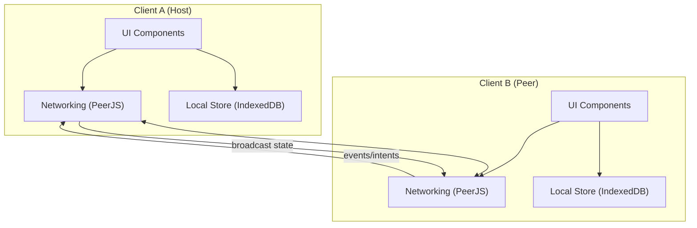

# Architecture Overview (Canonical)

> NOTE: AI must read docs/ai/README.md before modifying this file.

Version: 2026-02-04

Changelog:

- 2026-02-02: Consolidated high-level architecture here (canonical).
- 2026-02-02: Clarified host migration and noted planned event queue + manual host handoff.
- 2026-02-02: Split invite URL `/i/<roomId>` from GameRoom URL `/room/<roomId>`.
- 2026-02-03: Updated to reflect current race-to-claim takeover + stable `clientId`; clarified UI projections as the future direction for game/event work.
- 2026-02-03: Documented `hostClientId` and clarified presence/recognition is `clientId`-keyed (peerId is transport only).
- 2026-02-03: Reduced overlap with other foundation docs; flows and PeerJS implementation notes now live in dedicated docs.
- 2026-02-03: Added Testing section with Unit/Integration/E2E tables.
- 2026-02-04: Renamed Testing tables column to "Test Steps" and rewrote entries as ordered procedures.

## Summary

- Frontend-only app: static hosting + browser persistence.
- P2P networking: PeerJS/WebRTC data channels.
- Host-authoritative: host validates/applies events and broadcasts state.

## System diagram (high-level)

## Room identity (Option A)

- Invite URL: `/i/<roomId>` is the stable share identifier.
- GameRoom URL: `/room/<roomId>` is the in-app room page URL (not an invite link).
- Host peer id: **host uses `roomId` as PeerJS id**.
- Joiner flow: joiner connects directly to `roomId` to reach the host.

Tradeoff: 1 browser instance can host 1 room at a time (multiple rooms => multiple tabs/profiles).

## Data model (short)

- RoomMetadata: `{ roomId, gameId, hostId, hostClientId, players[], spectators[], maxPlayers, createdAt }`
- RoomSnapshot: `{ metadata, gameState, version, lastEventId }`

Identity note (current code):

- Participants carry a stable `clientId` (per browser profile; cleared via Settings → Clear data).
- Rejoin seat matching prefers `clientId` over displayName.
- Presence and “same person” recognition are keyed by `clientId` (not `peerId`). `peerId` is used for PeerJS addressing.

For the runtime handshake/takeover sequences, see `docs/foundation/flows.md`.

## Persistence

- IndexedDB-first for preferences + recent rooms + snapshots.
- LocalStorage for small items + boot defaults.
- BroadcastChannel for cross-tab sync.

## Host election & migration

Canonical constraints and flow diagrams:

- Constraints: `docs/foundation/constraints.md`
- Flows: `docs/foundation/flows.md`

PeerJS implementation notes and troubleshooting live in `docs/foundation/peerjs.md`.

## Many games, many event types

Deep-dive design lives in:

- `docs/architecture/many_games_many_event_types.md`

That doc defines:

- A game-specific event envelope + validation by game schema.
- Two-layer UI projections: room-level stable projections + game-level projections.

Direction (B):

- Today, the Hub UI derives its view directly from `{metadata, snapshot, presence}`.
- When implementing game domain events, we will introduce the two-layer projection model from the deep-dive so UI reads a stable `RoomUIModel` + per-game projections.

## Testing

### Unit tests

| Component | Purpose / Context | Test Steps | Expected Result |
|----------|-------------------|------------|----------------|
| RoomUI projections (current + future) | Keep room-level UI derived from stable inputs | Build UI model from fixtures; assert host badge + presence/role rendering; verify `clientId` keys drive identity (Coverage: `app/src/services/roomUiProjection.test.ts`) | UI output stable; no peerId-based identity drift |
| Persistence adapters | IndexedDB-first + LocalStorage fallback | Persist + reload displayName/recent rooms; simulate primary storage failure; verify fallback path used (Coverage: `app/src/services/persistence.test.ts`) | Fallback works; no crashes |

### Integration tests

| Component | Purpose / Context | Test Steps | Expected Result |
|----------|-------------------|------------|----------------|
| Networking + UI | Join → snapshot → render loop | Start room context with mock PeerService; connect to roomId; send `join_request`; apply received `room_snapshot` (Coverage: `app/src/hooks/useRoomContext.integration.test.ts`) | UI renders snapshot consistently across peers |
| Settings shared surface | Settings changes apply across routes | Open SettingsModal; change language/theme/chat flags; navigate HomePage ↔ GameRoom; re-render and assert settings applied (Coverage: `app/src/App.settingsmodal.test.tsx`) | Settings persist and affect HomePage + GameRoom |

### E2E tests

| Component | Purpose / Context | Test Steps | Expected Result |
|----------|-------------------|------------|----------------|
| Architecture invariants | Basic user journeys on real browser | Run `npm run test:e2e`; cover HomePage create/join and GameRoom UX at default viewport (Coverage: `app/e2e/homepage.spec.ts`, `app/e2e/gameroom.spec.ts`) | Create/join room works; UI responsive; persistence survives reload |
