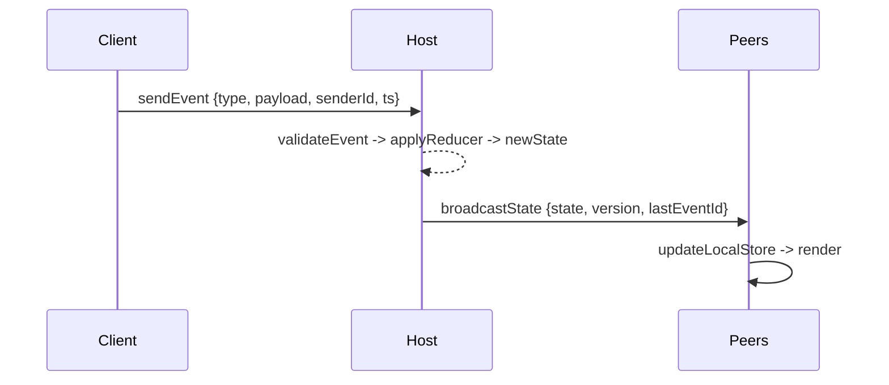
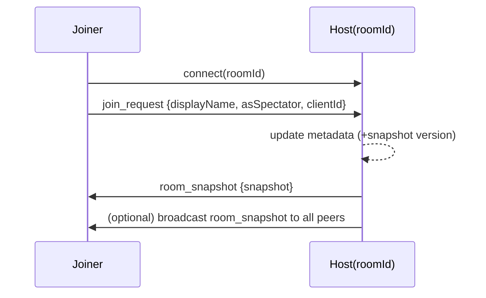
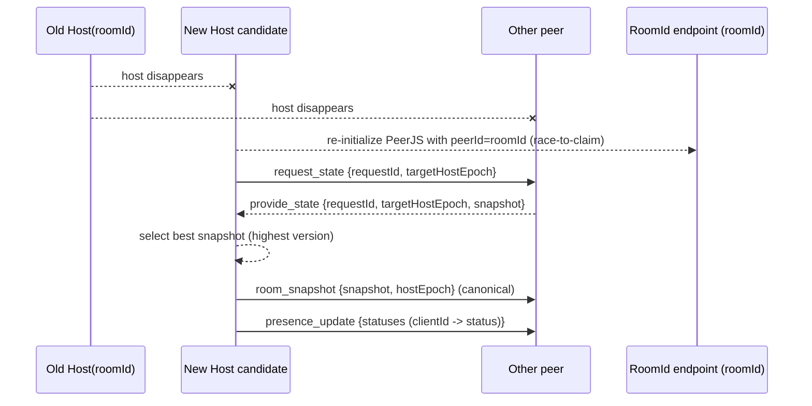
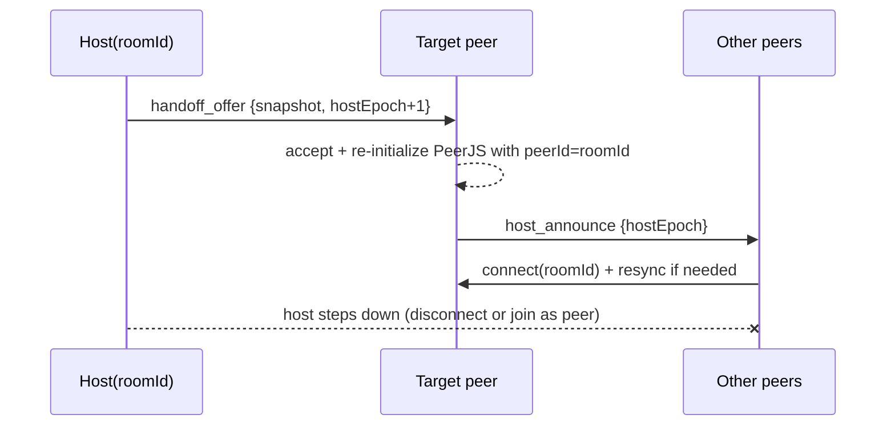

# Core Flows

> NOTE: AI must read docs/ai/README.md before modifying this file.

<!-- markdownlint-disable MD022 MD032 MD031 MD040 MD060 -->

Version: 2026-02-04

Changelog:
- 2026-02-02: Consolidated core flows here (canonical).
- 2026-02-02: Documented current refresh/resume behavior (auto-rejoin, host restore fallback, and failure handling).
- 2026-02-02: Linked host-down detection/takeover proposal (A/B) for review.
- 2026-02-03: Canonicalized host migration as race-to-claim + state transfer; removed deterministic takeover option framing.
- 2026-02-03: Presence/presence_update is keyed by stable `clientId` (peerId remains transport only); join_request includes clientId.
- 2026-02-03: Reduced overlap with other foundation docs; this file is now flow diagrams + short behavioral notes.
- 2026-02-03: Added Testing section with Unit/Integration/E2E tables.
- 2026-02-04: Renamed Testing tables column to "Test Steps" and rewrote entries as ordered procedures.
- 2026-02-04: Clarified takeover gating (only after host-down/reconnecting is suspected) and updated E2E coverage to match implemented PeerJS tests.

## 1) Event lifecycle (host authoritative)

## Testing

### Unit tests

| Component | Purpose / Context | Test Steps | Expected Result |
|----------|-------------------|------------|----------------|
| Envelope guards | `roomId` + `hostEpoch` validation | Feed envelopes with missing/mismatched `roomId`/`hostEpoch`; assert they are ignored (Coverage: `app/src/hooks/useRoomContext.foundation.test.ts`) | Invalid envelopes rejected/ignored |
| Snapshot selection | Choose best snapshot during state transfer | Provide multiple candidate snapshots with different versions during takeover; assert the chosen snapshot is the highest-version one (Coverage: `app/src/hooks/useRoomContext.integration.test.ts`) | Highest-version snapshot chosen consistently |

### Integration tests

| Component | Purpose / Context | Test Steps | Expected Result |
|----------|-------------------|------------|----------------|
| Join handshake | Joiner receives snapshot after join_request | Connect joiner; send `join_request`; wait for `room_snapshot`; assert UI model updated (Coverage: `app/src/hooks/useRoomContext.integration.test.ts`) | room_snapshot received; UI renders |
| Takeover with transfer | request_state/provide_state + canonical broadcast | Force host silence; claim stable endpoint; request snapshots; broadcast canonical snapshot + hostEpoch bump (Coverage: `app/src/hooks/useRoomContext.integration.test.ts`) | Peers converge on canonical snapshot and new hostEpoch |

### E2E tests

| Component | Purpose / Context | Test Steps | Expected Result |
|----------|-------------------|------------|----------------|
| PeerJS host migration | Real signaling + WebRTC channels + takeover | Run `npm run test:e2e:peerjs` (auto-starts local signaling + sets `VITE_E2E_DISABLE_PEERJS=0`) → run `app/e2e/host-migration.peerjs.spec.ts`, `app/e2e/host-migration.pair.peerjs.spec.ts`, `app/e2e/host-migration.matrix.peerjs.spec.ts`; Skips: suite skipped unless PeerJS enabled (`test.skip(!isPeerJsEnabledForThisRun(), ...)` in each spec); matrix skips WebKit on Windows (`test.skip(nodePlatform === "win32" && ...includes("webkit"), ...)`) | Room continues; UI converges; no split-brain |

## 2) Join / room handshake (Option A)

## 2.5) Refresh / resume (current app behavior)

This section describes how the current Hub app behaves on browser refresh while on the GameRoom route.

### Player refresh on `/room/:roomId`

- On refresh, the app restores `{roomId, metadata, snapshot, displayName}` from persistence.
- If the user previously joined the room (has stored join prefs), the app attempts auto-rejoin:
  - Initialize a PeerJS peer id (prefer device id; fall back to a new id if reuse is rejected).
  - Connect to the stable room endpoint (`connect(roomId)`).
  - Send `join_request {displayName, asSpectator, clientId}` and wait for `room_snapshot`.
- If join fails (e.g., host is offline and no takeover yet):
  - The app stays on `/room/:roomId` (it does not redirect to Home).
  - The user can explicitly leave/cancel from the room UI.

### Host refresh on `/room/:roomId`

- If the runtime restores a room where the current user is the host, it first tries to restore the host session:
  - Initialize PeerJS with the host peer id.
- If that fails (e.g., takeover already happened and `roomId` is claimed by another peer):
  - The old host falls back to joining as a normal peer via the join handshake above.

This aligns with the constraint: “Old host returns: it must join as a normal peer and must not claim `roomId` if the endpoint is occupied.”

## 3) Host migration (current app behavior)

This section describes the current Hub implementation when the host disappears unexpectedly.

- Host liveness is derived from host messages, primarily `presence_update` from `senderId === roomId`.
- Non-host peers periodically try:
  - reconnect to `connect(roomId)` + `join_request`, and
  - claim `peerId = roomId` via PeerJS re-initialization.
- Takeover attempts are gated by host-down suspicion: peers should only attempt to claim `peerId = roomId` once they have entered a recovery state (UI is `reconnecting`/`offline`) based on host liveness thresholds, and never during the initial join handshake or while the host is considered `connected`.
- The first peer to successfully claim `roomId` becomes the host, increments `hostEpoch`, and begins broadcasting `presence_update`.
- Peers recognize the new host when they receive `presence_update` from `senderId === roomId`.
- The new host performs **state transfer** by requesting snapshots from other peers, selecting the best available snapshot, and broadcasting a canonical `room_snapshot`.

Notes:

- This is a pragmatic, non-deterministic "race-to-claim" approach.
- State transfer is part of the canonical takeover to reduce data loss.

## 3.1) Host migration: state transfer (canonical)

Related review doc (implementation notes and constraints):

- `docs/features/GameRoom/proposals/HostDisconnectAndTakeover.md`

## 4) Manual host handoff (target)

Goal: host chủ động chuyển quyền host cho một peer khác (không phải do disconnect).

